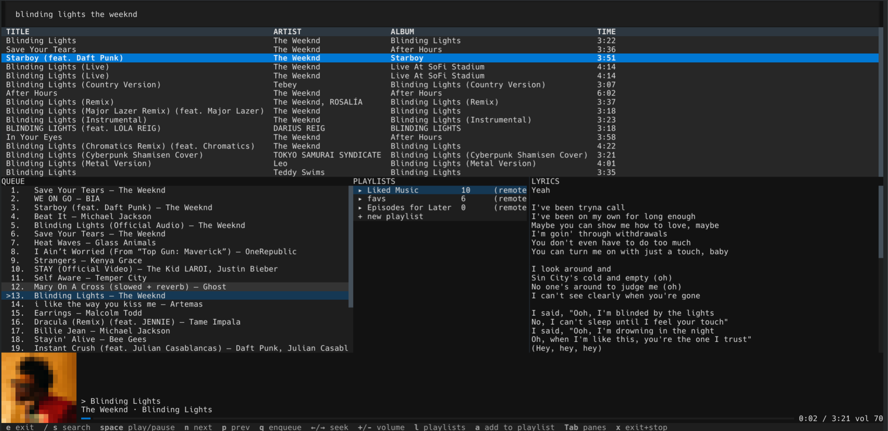

<h1 align="center">ytm</h1>
<p align="center">YouTube Music in the terminal: search, queue, radio and lyrics, with mpv doing the playing.</p>

<p align="center">
  
  
  
  
  
</p>



## Overview

YouTube Music has no desktop client that is not a browser. `ytm` is a small Python CLI and a Textual TUI over three tools that already do the hard parts: [ytmusicapi](https://github.com/sigma67/ytmusicapi) for the catalogue, [yt-dlp](https://github.com/yt-dlp/yt-dlp) for stream resolution and [mpv](https://mpv.io) for audio.

mpv is the only long-running process. `ytm` starts it once, idle, with a JSON IPC socket, and every command after that is a stateless message to it. Close the terminal and the music keeps playing. A Lua script inside mpv keeps the queue fed with the station for whatever is playing, so it never runs dry.

## Quickstart

```bash
pipx install ytm              # or: uv tool install ytm   /   pip install ytm

ytm auth                      # cookies from a logged-in browser, see Authentication
ytm play "daft punk"          # search, play the first hit, radio follows
ytm                           # the TUI
ytm update                    # later: newest ytm and yt-dlp, whatever installed it
```

To hack on it instead:

```bash
git clone https://github.com/MaheshBhushan/yt-music-cli.git && cd yt-music-cli
python3 -m venv .venv && source .venv/bin/activate
pip install -e '.[dev]'
```

> [!IMPORTANT]
> `mpv` must be on your `PATH`; pip cannot install it. `pacman -S mpv`, `apt install mpv`, `brew install mpv`, or the installers at <https://mpv.io>. Node is optional but recommended: yt-dlp uses it to solve YouTube's JavaScript challenges.

## Usage

The TUI is `ytm` with no arguments. Results appear as you type; Enter plays the first one. Every key is listed in the bar at the bottom, and everything is clickable: results, queue rows, playlists, the progress bar, the shortcuts.

| Key | Action |
|---|---|
| `/` or `s` | Focus search |
| `Enter` | Play the selected result, queue entry or playlist |
| `q` | Enqueue the selected result |
| `space` | Play / pause |
| `n` `p` | Next / previous |
| `←` `→` | Seek 5 s |
| `+` `-` | Volume |
| `a` | Add the selected song to a playlist: `a`, pick the list with `↑` `↓`, `a` or `Enter` |
| `l` | Focus playlists |
| `Tab` | Cycle panes |
| `e` | Exit, music keeps playing |
| `x` | Exit and stop mpv |

One-shot commands talk to the same mpv. Add `--json` to any of them for machine-readable output.

```bash
ytm search "song name" -n 10   # results are numbered
ytm play 3                     # a number from the last search, an 11-char video id, or a query
ytm add 4                      # enqueue
ytm radio                      # replace the queue with a station for the current track
ytm status | queue | lyrics | like
ytm pause | resume | toggle | next | prev | stop
ytm seek -10 | seek --to 90 | volume 60 | clear | shuffle
ytm quit                       # stop mpv entirely
ytm update                     # upgrade ytm and yt-dlp; --check only reports
```

The queue never holds a track twice: playing something already queued jumps to it, and radio skips what is there.

## Authentication

Search works signed out, but library, playlists, likes and lyrics need your account. Credentials live in `~/.config/ytm/auth.json` (mode 0600) and are validated with a live call before being kept.

```bash
ytm auth                          # cookies from Chrome, Chromium, Edge, Brave, Vivaldi, Opera or Firefox
ytm auth --from-browser firefox   # pick one
ytm auth --manual                 # paste request headers copied from DevTools
ytm auth --oauth                  # device-code flow, for SSH and headless boxes
```

Browser cookies expire after a few weeks; re-run `ytm auth` when the app says so. OAuth needs your own Google Cloud client (YouTube removed the shared one in 2024): create an OAuth client of type *TVs and Limited Input devices* and pass `--client-id`/`--client-secret`, or set `YTM_OAUTH_CLIENT_ID`/`YTM_OAUTH_CLIENT_SECRET`.

> [!NOTE]
> Streams resolve **anonymously by default**. With account cookies, YouTube hands out URLs that require an account-bound proof-of-origin token and then answers 403. Anonymous resolution plays the same catalogue. Set `behaviour.authenticated_streams = true` only if you need private or age-gated tracks.

## Configuration

`~/.config/ytm/config.toml`. A missing file means these defaults; a partial file overrides only what it names; a bad value is warned about and ignored.

```toml
[audio]
volume = 70
device = "auto"                 # an mpv --audio-device name

[behaviour]
autoplay_radio = true           # keep the queue fed with radio
confirm_remote_delete = true
authenticated_streams = false   # see the note above

[ui]
theme = "dark"                  # or "light"
art = "blocks"                  # blocks | kitty | sixel | auto | ascii | off

[pot]
enabled = true                  # proof-of-origin tokens via bgutil-ytdlp-pot-provider
base_url = "http://127.0.0.1:4416"

[keys]
toggle = "space"
next = "n"
prev = "p"
search = "/"
quit = "e"

[update]
check = true                    # ask PyPI once a day, toast in the TUI when newer
auto = false                    # true: install it (and fresh yt-dlp) automatically
```

`art = "blocks"` draws the cover with coloured half-cell glyphs and works in every terminal, tmux included. `kitty` and `sixel` use the terminal's pixel protocol; Sixel is known to freeze the pane in Konsole, which is why it is opt-in.

The proof-of-origin token provider is a yt-dlp plugin installed with `ytm`. It asks an HTTP service for tokens when YouTube demands one; run `docker run -d --name bgutil-provider -p 4416:4416 brainicism/bgutil-ytdlp-pot-provider` if you want it, or set `enabled = false`. Playback works without it for most accounts.

## More

- **Offline cache.** `ytm cache add <video_id>` downloads a track into `~/.cache/ytm/tracks/`; `cache rm` and `cache list` manage it. 2 GB cap, least-recently-played evicted first.
- **Local playlists** live in `~/.local/state/ytm/playlists.json` and show up next to your YouTube Music playlists in the TUI.
- **Media keys.** `ytm` has no MPRIS of its own; install the [mpv-mpris](https://github.com/hoyon/mpv-mpris) plugin and mpv announces itself to your desktop.
- **Updating.** `ytm update` upgrades ytm and yt-dlp through whatever installed them (pipx, `uv tool`, or pip), so the new version lands where the `ytm` command runs from. The TUI checks PyPI once a day and shows a toast when there is a newer release; set `auto = true` under `[update]` to have it install without asking. yt-dlp is why this matters: YouTube changes things and yt-dlp follows within days, so a stale copy is the usual cause of sudden "could not resolve" failures.
- **Windows** is supported in design (named-pipe IPC, no D-Bus) but has not been tested.
- **Logs.** mpv writes to `~/.local/state/ytm/mpv.log`.

## Repository structure

```
ytm/
  cli.py            commands and the mpv launch configuration
  player.py         Player: mpv over JSON IPC
  music.py          ytmusicapi wrappers, Track
  state.py          remembered searches and track metadata
  auth.py           browser cookies, DevTools headers, OAuth
  cache.py          offline downloads
  update.py         version check against PyPI, in-place upgrade
  mpv/autoplay.lua  radio autoplay inside mpv
  tui/              Textual app, panes, backend over Player
tests/              pytest; no network and no mpv needed
.github/workflows/  tests on 3.11-3.13; publish to PyPI on a v* tag
```

```bash
pip install -e '.[dev]' && pytest -q
```

## License

MIT, see [LICENSE](LICENSE).
