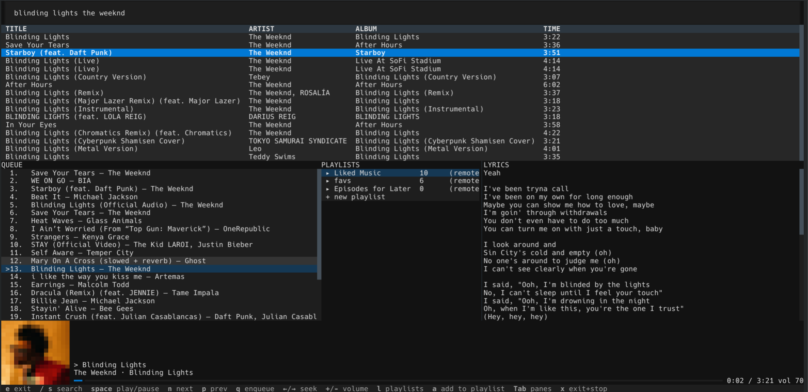

<h1 align="center">ytm</h1>
<p align="center">YouTube Music in the terminal: search, queue, radio and lyrics, with mpv doing the playing.</p>

<p align="center">
  
  
  
  
  
</p>



The TUI lyrics pane highlights and automatically scrolls to the current line when YouTube Music provides timestamps. It follows playback, pauses and seeks; tracks without timing data show plain lyrics. `ytm lyrics` still prints plain text.


## Overview

YouTube Music has no desktop client that is not a browser. `ytm` is a small Python CLI and a Textual TUI over three tools that already do the hard parts: [ytmusicapi](https://github.com/sigma67/ytmusicapi) for the catalogue, [yt-dlp](https://github.com/yt-dlp/yt-dlp) for stream resolution and [mpv](https://mpv.io) for audio.

mpv is the only long-running process. `ytm` starts it once, idle, with a JSON IPC socket, and every command after that is a stateless message to it. Each interactive TUI session owns its player: exiting the TUI or closing its terminal stops that session’s playback and helper processes. One-shot CLI playback still runs independently in the background. A Lua script inside mpv keeps the queue fed with the station for whatever is playing, so it never runs dry.

## Quickstart

```bash
pipx install ytm              # or: uv tool install ytm   /   pip install ytm

ytm install-mpv               # mpv plays the audio and pip cannot install it
ytm search "daft punk"        # public: no account needed
ytm play "daft punk"          # search, play the first hit, radio follows
ytm                           # the TUI
ytm update                    # later: newest ytm and yt-dlp, whatever installed it

# Account features (library, likes, your playlists):
ytm login                     # a real browser session, see Authentication
ytm liked
ytm library
ytm playlists
```

To hack on it instead (add the `login` extra to work on browser sign-in):

```bash
git clone https://github.com/MaheshBhushan/yt-music-cli.git && cd yt-music-cli
python3 -m venv .venv && source .venv/bin/activate
pip install -e '.[dev]'       # or '.[dev,login]'
```

> [!IMPORTANT]
> `mpv` must be on your `PATH`. It is a separate program and pip cannot install it, so `ytm install-mpv` does: it runs your own package manager (`brew install mpv`, `sudo apt-get install -y mpv`, `sudo pacman -S mpv`, `scoop install mpv`, ...), showing the command first. Or install it yourself from <https://mpv.io>. Node is optional but recommended: yt-dlp uses it to solve YouTube's JavaScript challenges.

## Usage

The TUI is `ytm` with no arguments. Results appear as you type; Enter plays the first one. Every key is listed in the bar at the bottom, and everything is clickable: results, queue rows, playlists, the progress bar, the shortcuts. Your daily mixes (Supermix, Discover Mix, ...) sit below your playlists. In a terminal under 100 columns or 24 rows, such as a tmux pane, the layout collapses to the search box, the queue and the player strip; `l` switches the middle row to your playlists, and leaving them brings the queue back.

| Key | Action |
|---|---|
| `/` or `s` | Focus search. While the search box has focus every letter is text, so the letter keys below wait for `Esc` or `↓` |
| `Esc` `↓` | Leave the search box for the lists |
| `h` | Hide the search box and results while listening; `s`, `/` or `h` bring them back |
| `Enter` | Play the selected result, queue entry or playlist |
| `q` `u` | Enqueue the selected song at the end / play it next |
| `space` | Play / pause |
| `n` `p` | Next / previous |
| `←` `→` | Seek 5 s |
| `+` `-` | Volume (`=` also raises it). This is the system output volume, so it matches the tray and the media keys; see `[audio] control` |
| `a` | Add the selected song to a playlist: `a`, pick the list with `↑` `↓`, `a` or `Enter` |
| `l` | Focus playlists (in a compact terminal, switches the middle row to them) |
| `r` | Refresh your mixes (a mix keeps the same tracklist until you do) |
| `Tab` | Cycle panes |
| `e` | Exit and stop this session’s player |
| `x` | Exit and stop this session’s player (same as `e`) |

One-shot commands share a background mpv, separate from the player owned by each TUI session. Add `--json` to any of them for machine-readable output.

```bash
ytm search "song name" -n 10   # results are numbered
ytm play 3                     # a number from the last search, an 11-char video id, or a query
ytm add 4                      # enqueue; add --next 4 puts it right after the current song
ytm radio                      # replace the queue with a station for the current track
ytm mix                        # list your daily mixes (Supermix, Discover Mix, ...)
ytm mix discover               # replace the queue with a mix, matched by substring
ytm liked | library            # account lists; empty results are not errors
ytm playlists                  # your playlists; --local for the ones stored here
ytm login | account | logout   # sign in, inspect the session, sign out locally
ytm status | queue | lyrics | like
ytm pause | resume | toggle | next | prev | stop
ytm seek -10 | seek --to 90 | volume 60 | clear | shuffle
ytm quit                       # stop mpv entirely
ytm version                    # the running version (and a newer one, if the daily check saw it)
ytm update                     # upgrade ytm and yt-dlp; --check only reports
ytm install-mpv                # install mpv with this machine's package manager
```

The queue never holds a track twice: playing something already queued jumps to it, and radio skips what is there.

## Authentication

Search, playback, radio, lyrics and public playlists work signed out. Your library, likes, playlists and daily mixes need an account.

```bash
ytm login                     # opens a real browser window; sign in there
ytm login --from-browser      # or import cookies from a browser you are already signed in to
ytm account                   # what is signed in, and whether the session still works
ytm logout                    # sign out locally: tombstone plus credential cleanup
```

### Browser session (default)

`ytm login` opens your operating system's default browser, using its normal profile. Sign in at Google's real page, then return to the terminal and press Enter. ytm imports only the selected browser profile's YouTube cookies, verifies the account with YouTube Music, asks you to confirm it, and stores the session. It never asks for your Google password.

```bash
ytm login                            # supported OS default browser
ytm login --browser chrome           # Chrome's Default profile
ytm login --browser chrome --profile "Profile 1"
ytm login --browser firefox          # Firefox's configured default profile
ytm login --browser edge --authuser 1 # second Google account
```

Chrome, Chromium, Edge, Firefox, Brave, Vivaldi, Opera and Helium are supported browser choices. Browser discovery and cookie decryption depend on the operating system and installation; sandboxed distributions may need explicit import. Safari is not supported. Chrome-family profiles default to the directory named `Default`, not the last active profile. Firefox uses its configured default. Use `--profile` to choose another.

> [!NOTE]
> **Verification status.** Browser discovery, profile selection and the login state machine are unit-tested with simulated platforms, and the native flow has been exercised on Linux. Real sign-in has not been certified on macOS or Windows, and Windows App-Bound Encryption can block cookie extraction even when the browser opens. Unsupported combinations are a documented limit, not a wrong password; report the failure category instead of assuming the account was rejected.

Answering `n` at account confirmation cancels without replacing existing credentials. `--yes` skips this final confirmation; normal-profile login still requires a terminal and Enter after sign-in. ytm never closes your normal browser. If its cookie database is locked, close it yourself before pressing Enter. `--timeout` is checked after you return from the terminal prompt; it cannot interrupt a blocking Enter prompt.

### Windows: Chrome is signed in but import fails

A successful Chrome login does not guarantee that another program can read its stored cookies. `database_copy_failed` usually means Chrome still holds its database open, or the OS denies access. Close Chrome yourself (including its background processes), use the same Windows user, and retry with the correct profile:

```powershell
ytm login --from-browser chrome --profile "Default"
```

Use `"Profile 1"` or another directory name if that is where Music is signed in. An encryption failure is different: Chrome's App-Bound Encryption can prevent external decryption even after Chrome closes. Do not disable Chrome's security or run YTM as Administrator to bypass it. Sign in at music.youtube.com in Firefox and run `ytm login --from-browser firefox`, or try the isolated observation flow below (Google can reject automated browsers). See [Google's explanation of App-Bound Encryption](https://security.googleblog.com/2024/07/improving-security-of-chrome-cookies-on.html) and [yt-dlp's cookie database copy failure](https://github.com/yt-dlp/yt-dlp/issues/7271).

`ytm login` and `ytm auth` now record authentication diagnostics automatically. On failure the terminal prints the exact `auth-*.jsonl` path. New Windows installations use `%LOCALAPPDATA%\ytm\state\logs\`; older installations may retain their legacy logs directory. Share the printed authentication log for debugging. It contains dependency versions, classified extraction reasons, OS error numbers when available, and validation progress. It excludes raw exception messages, cookies, headers, tokens, account names and profile paths. Ten recent logs are retained, with a ten-minute grace period for active runs. These diagnostics are separate from mpv logs, which can contain signed media URLs.

### Isolated browser observation (optional)

For automatic page detection, use an isolated Playwright browser:

```bash
pip install "ytm[login]"
ytm login --install-browser                 # install bundled Chromium
ytm login --method playwright
ytm login --method playwright --browser chrome
ytm login --method playwright --browser edge
ytm login --install-browser --browser firefox
ytm login --method playwright --browser firefox
```

Chromium, installed Chrome/Edge channels, Playwright Firefox and WebKit are supported choices. These use a temporary browser context, not your usual profile. ytm observes only allowlisted YouTube Music session data and cookies, verifies the account, then closes its own browser. `--timeout SECONDS` bounds observation; closing the window cancels. Google may reject automated-browser sign-in. Normal-profile login or explicit import is the fallback.

Playwright cannot reliably attach to Chrome's ordinary default profile: Chrome 136+ disables remote debugging against its normal data directory. ytm therefore opens that profile normally and imports its session after your confirmation; it does not copy your profile or disable browser protections.

### Import from a browser

Already signed in at <https://music.youtube.com>? Import that browser's session instead; ytm validates the cookies with a read-only account call before storing anything:

```bash
ytm login --from-browser                # auto-detect the browser and profile
ytm login --from-browser firefox        # or name one: chrome, chromium, edge, brave, vivaldi, opera, helium, firefox
ytm login --from-browser helium --profile "Profile 1"
ytm login --from-browser --authuser 1   # second Google account in that browser
```

Auto-detection tries each browser in turn. Profile discovery for standard browsers is delegated to yt-dlp; it does not guarantee selection of your active Chrome profile. Use `--profile "Profile 1"` (or the actual directory name shown by `chrome://version`) when needed. The custom Chromium-fork extractor tries eligible profiles and skips System/Guest profiles. Each browser's failure reason is reported: not installed, no such profile, cookies could not be decrypted, database locked, or no YouTube login. If the browser has several Google accounts, `--authuser N` (0 is the first) or `auth.x-goog-authuser` in `config.toml` picks the default.

New browser-session records require `ytm login` again when they expire. Legacy imports with a recorded source retain their existing single reimport attempt. OAuth retains its own token-refresh mechanism.

> [!WARNING]
> **Windows:** Chrome, Edge, Brave, Vivaldi and Opera encrypt their cookies with App-Bound Encryption (Chrome 127 and newer), which can prevent external cookie extraction in both normal-profile login and `--from-browser`. Use **Firefox**, isolated `--method playwright` if Google permits it, or OAuth.

> [!WARNING]
> **macOS:** privacy controls or Keychain permissions can prevent browser import. If the error indicates a disk-access restriction, review: **System Settings → Privacy & Security → Full Disk Access**, switch your terminal on (add it with **+** if it is not listed), then quit it completely and reopen it. The import says so when this is what stopped it.

### Status, expiry and logout

```bash
ytm account             # checks with YouTube Music whether the session still works
ytm account --no-check  # local facts only, no network
```

`account` distinguishes **expired** (YouTube rejected the session: run `ytm login`), **unknown** (offline or provider trouble: credentials are kept and nothing is deleted), and **invalid** (the stored record is unreadable). Permission errors (HTTP 403) are reported as permission problems with that operation, never as an expired sign-in.

Updates keep credentials in the per-user locations below. Updating or restarting ytm does not require another login. An unreadable account response leaves verification **unknown**; it does not prove that your session expired. Google can still expire or revoke a session independently of an update.

`ytm logout` is local and idempotent: it writes a logged-out tombstone and deletes ytm's credential copies (the legacy `auth.json`, its source sidecar, `cookies.txt`, and managed OAuth generations). The `session.json` tombstone remains. It never calls Google's logout or revocation endpoint, and never clears your normal browser cookies, local playlists, search history or cached audio. A file that cannot be removed is reported instead of hidden.

### Where credentials live

ytm stores a small versioned record in the platformdirs user configuration directory: Linux `~/.config/ytm/session.json` (or `$XDG_CONFIG_HOME/ytm`), macOS `~/Library/Application Support/ytm/session.json`, Windows `%LOCALAPPDATA%\ytm\session.json` (mode 0600, inside a 0700 directory on platforms that support it). It holds allowlisted request headers and an account index — never a password, page dump, screenshot or request body. Storage is permission-restricted, **not encrypted**; treat the file like a browser session. The legacy `~/.config/ytm/auth.json` is still read when no record exists and is left untouched until you next log in or out.

### OAuth (advanced)

OAuth remains for SSH, headless boxes, or when a browser session cannot be established:

```bash
ytm login --method oauth
ytm login --method oauth --client-file ~/Downloads/client_secret_....json
ytm login --method oauth --client-id YOUR_CLIENT_ID --client-secret YOUR_CLIENT_SECRET
```

The legacy `ytm auth` command keeps its established OAuth and `--from-browser` behaviour for existing scripts; new setups should use `ytm login`.

### OAuth setup

`ytm login --method oauth` opens Google sign-in using ytm's bundled Desktop app client. Approve access in the browser on the same computer; no client ID, client secret, or Google Cloud project is needed. The token refreshes itself. If the browser does not open, use the printed link. Google may restrict access while the app is in Testing; the project owner must add your account as a test user in that case.

Release packages include the default client at build time; source checkouts need their own client configuration. Existing saved Desktop clients and explicit flags/environment variables still take precedence. To use your own client, or set up the device-code flow for SSH/headless use:

1. Go to <https://console.cloud.google.com/> and create or pick a project.
2. **APIs & Services → Library**: enable **YouTube Data API v3**.
3. **APIs & Services → OAuth consent screen**: External is fine. Add your own Google account under **Test users**.
4. **APIs & Services → Credentials → Create credentials → OAuth client ID**. Pick one of the two application types below, name it and create.

**Desktop app** (a browser on the machine running ytm): download the client JSON, then

```bash
ytm login --method oauth --client-file ~/Downloads/client_secret_....json
ytm login --method oauth          # later: the client is remembered
```

Open the printed link in a browser on the same computer and approve YouTube access. The callback listens only on loopback, uses PKCE, and gives up after 15 minutes. `YTM_OAUTH_CLIENT_FILE` can name the JSON instead of the flag. The client is remembered alongside its token in a managed OAuth generation under the configuration directory; a failed or incomplete sign-in leaves your existing credentials untouched.

**TVs and Limited Input devices** (SSH and headless boxes: the link can be opened on any device): copy the **Client ID** and **Client secret**, then

```bash
ytm login --method oauth --client-id YOUR_CLIENT_ID --client-secret YOUR_CLIENT_SECRET
```

ytm prints a URL and a short code; open the URL anywhere, sign in and enter the code. The flags can also come from `YTM_OAUTH_CLIENT_ID` / `YTM_OAUTH_CLIENT_SECRET`, and with neither set `ytm` prompts for them. (`ytm auth` accepts the same OAuth flags for compatibility.)

Either way the client ID and secret are kept in `~/.config/ytm/oauth_client.json` (mode 0600) because every token refresh needs them again. Revoking access in your Google account is reported as expired auth; run `ytm login --method oauth` again.

> [!NOTE]
> Streams resolve **anonymously by default** for everyone. With account cookies, YouTube hands out URLs that require an account-bound proof-of-origin token and then answers 403. Anonymous resolution plays the same catalogue. Set `behaviour.authenticated_streams = true` only if you need private or age-gated tracks.

## Configuration

`~/.config/ytm/config.toml`. A missing file means these defaults; a partial file overrides only what it names; a bad value is warned about and ignored.

```toml
[audio]
control = "system"              # "system": the desktop's output volume; "player": mpv's own
volume = 70                     # mpv's starting volume, only with control = "player"
device = "auto"                 # an mpv --audio-device name

[behaviour]
autoplay_radio = true           # keep the queue fed with radio
confirm_remote_delete = true
authenticated_streams = false   # see the note above

[auth]
x-goog-authuser = "0"           # Google account index for browser auth cookies

[ui]
theme = "dark"                  # or "light"
art = "blocks"                  # blocks | kitty | sixel | auto | ascii | off

[tui]
queue_column_width = 40         # max PLAYED / UP NEXT column width; 0 = no max

[pot]
enabled = true                  # proof-of-origin tokens via bgutil-ytdlp-pot-provider
base_url = "http://127.0.0.1:4416"

[keys]
toggle = "space"
next = "n"
prev = "p"
search = "/"
quit = "e"

[update]
check = true                    # ask PyPI once a day, toast in the TUI when newer
auto = false                    # true: install it (and fresh yt-dlp) automatically
```

`control = "system"` makes the volume in ytm the same one the desktop shows: `+`/`-` and `ytm volume` move the default output through `wpctl` (PipeWire), `pactl` (PulseAudio), or Windows Core Audio, and a media key or the tray slider shows up in the TUI. mpv's own volume is held at 100 so the stream is not attenuated twice. When no system mixer or Windows audio endpoint is available, or with `control = "player"`, ytm uses mpv's software volume, which only ytm sees.

`art = "blocks"` draws the cover with coloured half-cell glyphs and works in every terminal, tmux included. `kitty` and `sixel` use the terminal's pixel protocol; Sixel is known to freeze the pane in Konsole, which is why it is opt-in.

The proof-of-origin token provider is a yt-dlp plugin installed with `ytm`. It asks an HTTP service for tokens when YouTube demands one; run `docker run -d --name bgutil-provider -p 4416:4416 brainicism/bgutil-ytdlp-pot-provider` if you want it, or set `enabled = false`. Playback works without it for most accounts.

## More

- **Offline cache.** `ytm cache add <video_id>` downloads a track into `~/.cache/ytm/tracks/`; `cache rm` and `cache list` manage it. 2 GB cap, least-recently-played evicted first.
- **Local playlists** live in `~/.local/state/ytm/playlists.json` and show up next to your YouTube Music playlists in the TUI.
- **Media keys.** `ytm` has no MPRIS of its own; install the [mpv-mpris](https://github.com/hoyon/mpv-mpris) plugin and mpv announces itself to your desktop.
- **Updating.** `ytm update` upgrades ytm and yt-dlp through whatever installed them (pipx, `uv tool`, or pip), so the new version lands where the `ytm` command runs from. The TUI checks PyPI once a day and shows a toast when there is a newer release; set `auto = true` under `[update]` to have it install without asking. On Windows, interactive `ytm update` asks to exit and continue in a new PowerShell window. Close other ytm instances first: the helper waits for the original process and launcher locks, runs the installer, and verifies the installed version. It never terminates processes or requests elevation, and keeps the manual command visible if updating fails. TUI automatic updates, `--json`, and noninteractive calls still show the manual command. yt-dlp is why this matters: YouTube changes things and yt-dlp follows within days, so a stale copy is the usual cause of sudden "could not resolve" failures.
- **Windows** works over a named pipe to mpv. The test suite runs natively on Windows in CI (Python 3.11 and 3.13): the named-pipe transport, job-object process ownership, `msvcrt` storage locking and the PowerShell updater tests actually execute there. Windows system-volume control uses the default Core Audio output and follows device changes; it preserves mute. If no endpoint is available, it falls back to mpv volume. Hosted CI checks silent local decoding; audible output, device switching and real Google login still need desktop validation. Cookie import can be blocked by Chromium App-Bound Encryption (see Authentication), and native sign-off of a real browser login is still pending.
- **Where files live.** On new Windows installations, config and the active authentication record live under `%LOCALAPPDATA%\ytm\`; playback state, playlists and logs use its `state\` subdirectory, and audio uses `cache\tracks\`. Older files remain readable at their existing locations until migrated. Run `ytm migrate-paths` for a preview, close other YTM instances, then run `ytm migrate-paths --apply` to copy managed configuration, state and cached tracks. Originals remain as backups, conflicting destinations are never overwritten, and authentication files are never copied by this command. Restart YTM after migration. Explicit `XDG_STATE_HOME` and `XDG_CACHE_HOME` overrides remain authoritative. Linux/macOS config, state and cache retain their existing locations (`~/.config/ytm/`, `~/.local/state/ytm/`, `~/.cache/ytm/`). Active authentication uses platformdirs, including `~/Library/Application Support/ytm/session.json` on macOS. Legacy `~/.config/ytm/auth.json` remains readable through the authentication compatibility path.
- **Shutdown and ownership.** Playback helpers (mpv, its yt-dlp, any JavaScript runtime) belong to the interactive session: on Windows they are grouped in a kill-on-close job object, created suspended and assigned before they can run, so quitting or crashing the TUI removes the whole owned tree. The browser opened for login and the detached updater are deliberately outside that job and are never terminated with playback.
- **Command replies and playback errors.** Every mpv command has a bounded reply timeout, on POSIX and on Windows; a player that stops answering reports a safe error instead of hanging, and the event observer stays cancelable. An asynchronous playback failure (a stream that fails after `loadfile` succeeded) shows "Could not play this track. Try another track or retry playback." instead of silence, while stop, skip, EOF and deliberate replacement stay silent.
- **Cover-art warning.** On Python 3.11, `textual-image` 0.12.0 (the newest release that supports it) triggers a Pillow deprecation warning from `Image.getdata()`. Upstream replaced that call in 0.13, which requires Python 3.12; the warning is tracked upstream and harmless until Pillow 14.
- **Logs.** mpv writes to `~/.local/state/ytm/mpv.log`. The TUI keeps a small bounded history of runs under `~/.local/state/ytm/logs/`: one `tui-<date>-<time>-<pid>.log` per launch, the newest ten kept, with keys, focus moves, backend requests and their timing, errors and resizes. Credential-looking values (cookie headers, signing cookies, tokens, signed URLs) are redacted before anything is written, and a failed launch is still readable after the restart that recovered from it. `YTM_TUI_LOG=<file>` pins one explicit file instead, truncated at each start. Attach the TUI trace for a key or focus problem; the mpv log is for local debugging only, because a resolved stream URL can appear in it.

## Benchmarks

Measured on 2026-09-25 with the harness in [`benchmarks/`](benchmarks/): the real `ytm` TUI in a 120x40 PTY with real audio output, inside a dedicated cgroup v2 scope, so the totals cover the YTM Python process, its mpv, and every owned helper (yt-dlp, Node, the radio helper, mixer tools) even when they detach. Signed in with browser credentials and the default configuration: lyrics, artwork, system volume, radio autoplay and update checks all enabled.

Host: CachyOS, kernel 7.1.1, Intel i5-1135G7 (8 threads), 23 GiB RAM, PipeWire 1.6.7, default sink. ytm 0.9.3 from the working tree (24 uncommitted files at run time), mpv 0.41.0, yt-dlp 2026.08.19, Node 26.4.0, Python 3.11.15.

| Scenario | Total RSS (MiB) | CPU (% of one core) | Latency (ms) |
| --- | ---: | ---: | ---: |
| Startup (to usable UI) | 128.3 | 10.5 | 1246 |
| Idle | 138.8 | 2.7 | — |
| Search (live) | 145.2 | 6.4 | 470 / 916 |
| Starting playback | 198.1 | 14.7 | 1911 / 3450 |
| Steady playback | 187.5 | 5.5 | — |
| Track skip (`n`) | 242.6 | 32.5 | 1739 / 3934 |
| 30-minute session | 183.7 | 7.0 | — |
| Peak observed | 292.7 | 248.8 | — |

Latency columns are median / P95. Memory and CPU maxima can occur at different times: the peak RSS sample (292.7 MiB) happened while yt-dlp and Node were resolving the next track during the 30-minute session, and the peak one-second CPU window (249% of one core) is stream resolution across multiple cores.

> Memory includes YTM, mpv, and all owned helper processes. RSS sums may double-count shared pages; PSS is provided in the report (idle 103.2 MiB, steady playback 149.6 MiB). Peaks are observed samples at 100 ms cadence. CPU uses 100% per logical core. Playback latency is the IPC proxy — a new file is loaded, playback is unpaused and the position clock advances — not time-to-audible-sound.

Search separates backend cache hits (29 trials, median 370 ms) from network searches (38 trials, median 747 ms); the end-to-end number includes the 350 ms debounce. Startup ends at an accepted input round-trip, not a painted cell. One of 80 switch attempts (a `next` during the long session) timed out and was retried; medians and P95 cover completed trials. Network byte accounting and audio-onset detection were not measured.

This run's generated report and machine-readable summary are in [`benchmarks/results-published/20260925T222443Z-967c5d/`](benchmarks/results-published/20260925T222443Z-967c5d/). Per-sample raw artifacts stay local; the report regenerates from them deterministically. Reproduce with `python benchmarks/benchmark.py run --profile full` (requirements and method notes in [`benchmarks/README.md`](benchmarks/README.md)).

## Repository structure

```
ytm/
  cli.py            commands and the mpv launch configuration
  player.py         Player: mpv over JSON IPC
  music.py          ytmusicapi wrappers, Track, public/account policy
  state.py          remembered searches and track metadata
  auth.py           auth facade: credential discovery, OAuth, browser import
  authentication/   session model, atomic storage, AuthManager, browser login
  cache.py          offline downloads
  update.py         version check against PyPI, in-place upgrade
  mpv/autoplay.lua  radio autoplay inside mpv
  tui/              Textual app, panes, backend over Player
tests/              pytest; no network and no mpv needed
benchmarks/         cgroup/PTY benchmark harness, tests, published reports
.github/workflows/  tests on 3.11-3.13; publish to PyPI on a v* tag
```

```bash
pip install -e '.[dev]' && pytest -q
```

## License

MIT, see [LICENSE](LICENSE).
