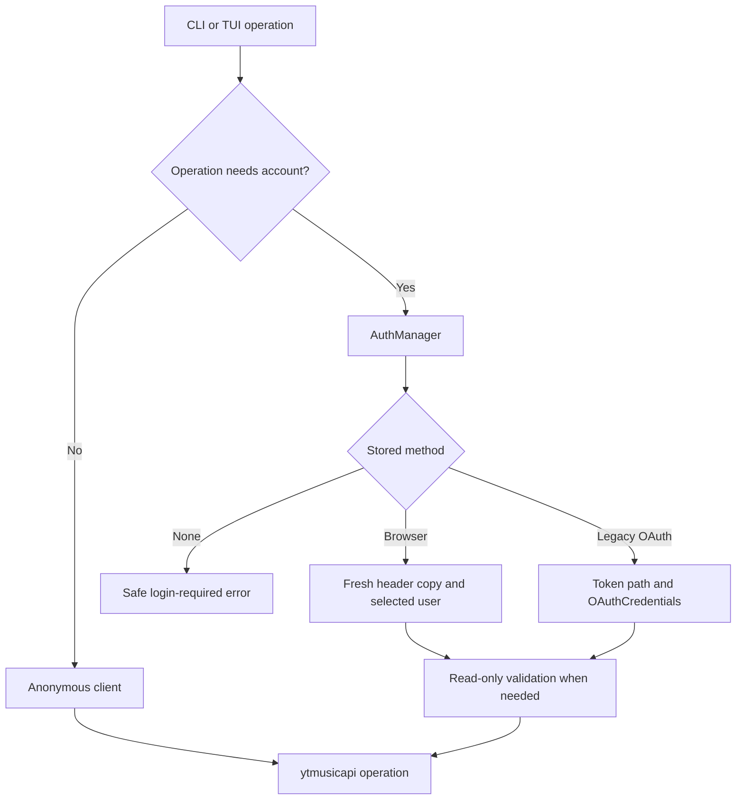

# YTM browser-session authentication: implementation handout

**Research date:** 2026-09-26  
**Deliverable:** source-backed architecture, migration plan, implementation sequence, and acceptance tests.  
**Status:** historical design/research baseline. Implementation and review now exist; see the [current review and multi-browser handout](BROWSER_AUTH_REVIEW_AND_MULTIBROWSER_HANDOUT.md) for actual behavior, fixes, tests and limitations. Real Google sign-in still requires manual verification.

### Navigation

- [Outcome](#1-outcome-and-non-negotiable-behavior)
- [Research baseline](#2-research-baseline-and-limits)
- [Existing YTM architecture](#3-phase-1--existing-ytm-architecture)
- [BitChord trace](#4-phase-2--bitchord-authentication-end-to-end)
- [ytmusicapi contract](#5-phase-3--verified-ytmusicapi-contract)
- [Proposed modules](#6-phase-4--proposed-module-architecture)
- [Browser login and feasibility](#7-browser-login-design-and-feasibility-gate)
- [Storage and security](#8-credential-storage-and-security)
- [Command contracts](#9-command-contracts)
- [Playlist access policy](#10-publicprivate-playlist-policy)
- [Expiration and retries](#11-expiration-and-provider-error-strategy)
- [Migration](#12-migration-and-backward-compatibility)
- [Implementation phases](#13-ordered-implementation-phases)
- [Test plan](#14-test-plan)
- [Documentation updates](#15-documentation-changes-to-make-during-implementation)
- [Release checklist](#16-review-checklist-and-release-criteria)
- [Adjacent findings](#17-adjacent-findings-to-track-explicitly)
- [Sources](#18-source-index-for-the-implementing-engineer)

## 1. Outcome and non-negotiable behavior

Public YouTube Music operations must use an anonymous `YTMusic()` client, even when credentials exist. Account operations must use a separately managed browser-session or existing OAuth client. New users should discover browser login through `ytm login`; creating a Google Cloud project must not be part of the normal onboarding path.

The implementation should produce this experience:

```console
$ ytm search "Blinding Lights"
1. ...

$ ytm liked
This command requires your YouTube Music account.
Run `ytm login` to sign in.

$ ytm login
Opening YouTube Music login...
Sign in using the browser window.
Waiting for YouTube Music authentication...
YouTube Music account verified.
Use this account: Example Listener? [Y/n]
Login successful. Credentials stored locally.

$ ytm liked
...

$ ytm account
Logged in: Yes
Authentication: Browser session
Session status: Valid

$ ytm logout
Signed out of YTM on this computer.

$ ytm search "Daft Punk"
1. ...
```

The account confirmation is an intentional first-release refinement of the ideal automatic flow. BitChord currently requires confirmation because immediately capturing a redirect can select the wrong personal or brand identity. A later release may omit confirmation where account selection is demonstrably unambiguous. Never turn an uncertain identity into a silent successful login.

Authentication success means all three of these happened:

1. A real YouTube Music page exposed a signed-in session.
2. A new ytmusicapi client successfully read account information using the captured state.
3. The validated state was committed to protected local storage and could be read back.

The existence of cookies, reaching a URL, constructing `YTMusic`, or successfully searching is insufficient individually.

## 2. Research baseline and limits

### 2.1 Sources actually inspected

| Source | Inspected revision/version | Notes |
|---|---|---|
| Local YTM workspace | `e3ab591865354944b84b4bd937cd6a858005a4a4` plus pre-existing uncommitted changes | Local `pyproject.toml` reports `0.9.3`; implementation must preserve unrelated work |
| YTM upstream default branch | `244a34d40026be6603e6da7e3e4baf93fe33016a` | Upstream `pyproject.toml` reports `0.9.5`; inspected `auth.py` and `music.py` match local working copies |
| BitChord default branch | `fe198ac0bde052f8b84cfd84b1d271f8f1fcc7b2` | Includes explicit account confirmation and multi-account/profile persistence |
| ytmusicapi PyPI release | `1.12.3` | PyPI metadata and downloaded source distribution inspected |
| ytmusicapi default branch | `bf310f7fc6041a51db229fd9d8ee96fa45c2cdbc` | Used to cross-check the authentication implementation |
| Local `.venv` dependency | `ytmusicapi 1.12.2` | Baseline tests below ran against this version |

Do not describe upstream changes, local modifications, and published package behavior as one identical version. Before implementation, re-check the selected base revision and dependency versions.

Existing uncommitted changes include CLI, music, TUI, player, lifecycle, volume, and tests. Existing handouts also exist. This document deliberately uses a new filename and does not replace them.

### 2.2 Baseline verification performed

```sh
.venv/bin/python -m pytest -q \
  tests/test_cli_core.py \
  tests/test_api.py \
  tests/test_from_browser.py \
  tests/test_oauth.py \
  tests/test_desktop_oauth.py \
  tests/test_auth_refresh.py
```

**Observed:** 140 tests passed in 3.92 seconds.

This establishes a scoped starting point, not proof that a future browser login works. No Google login, real credential extraction, account mutation, or authenticated live test was performed for this handout. No new authentication code was written.

### 2.3 Findings that change the initial assumptions

- **Search is already anonymous** in this checkout and current upstream. Preserve and strengthen the implementation; do not recreate a fix that already exists.
- **Plain `ytm auth` already has a browser-opening OAuth path** using a bundled desktop OAuth client when available. The friction is not universally “every user must create credentials”; provider restrictions and account-dependent API failures remain relevant.
- **Browser authentication already exists** through `ytm auth --from-browser`. The missing default experience is opening and observing an interactive browser session, followed by reliable account validation and safe persistence.
- **`ytm liked`, `ytm library`, `ytm playlists`, `ytm login`, `ytm logout`, and `ytm account` are not current top-level commands.** The desired UX requires adding commands, not merely rerouting existing handlers.
- **Public metadata, radio, lyrics, and playlist reads still have unnecessary authentication coupling.** Search alone does not finish public mode.
- **BitChord does not capture `INNERTUBE_CONTEXT` wholesale.** Its probe reads selected fields, and its API code constructs a request context.
- **Browser login reliability is unresolved on desktop.** Google may reject automated browsers even when the person types credentials manually. This is a release gate, not an implementation detail to assume away. [Google's supported-browser guidance](https://support.google.com/accounts/answer/7675428?hl=en)

## 3. Phase 1 — Existing YTM architecture

### 3.1 Source map

Paths below are relative to this repository. Symbols are preferable to line numbers when applying this guide after other changes.

| File | Relevant symbols | Responsibility today |
|---|---|---|
| `ytm/auth.py` | `AUTH_PATH`, `client`, `client_from_headers`, `_oauth_client` | Loads browser or OAuth credentials and constructs account clients |
| `ytm/auth.py` | `oauth_setup`, `desktop_oauth_setup`, `_ytmusicapi_token` | Device-code OAuth; desktop PKCE/loopback OAuth; token normalization |
| `ytm/auth.py` | `from_browser`, `_extract_browser_cookie_header`, `_cookie_header_from_jar` | Browser profile extraction using yt-dlp; conversion to headers |
| `ytm/auth.py` | `browser_source`, `source_path`, `refresh_from_browser` | Remembers source browser/profile/account index and reimports cookies |
| `ytm/auth.py` | `load_cookies`, `cookies_file` | Derives a Netscape cookie file for optional authenticated stream resolution |
| `ytm/auth.py` | `AuthError`, `AuthMissing`, `AuthExpired`, `is_expiry` | Existing authentication error interface |
| `ytm/music.py` | `catalogue_client`, `search` | Separate lazy anonymous search client |
| `ytm/music.py` | `shared_client`, `reset_client`, `_CLIENT` | Cached account client with generation-aware construction |
| `ytm/music.py` | `_seeded_headers`, `_read_visitor_id`, `_remember_visitor_id` | Visitor-ID persistence and seeding |
| `ytm/music.py` | `_refreshing`, `_wrap_ytmusic_error` | Browser reimport and request-error translation |
| `ytm/api.py` | Compatibility re-exports | Older public imports forward to `music.py` |
| `ytm/cli.py` | `build_parser`, `cmd_auth`, `main`, `select` | Argument parsing, auth command dispatch, errors, query/ID selection |
| `ytm/tui/backend.py` | `Backend.request`, `_playlist_list`, `_playlist_get`, `_playlist_add` | UI-facing catalogue, local playlist, remote account operations |
| `ytm/cache.py` | Download and playback helpers | Anonymous downloads and local cache behavior |
| `ytm/config.py` | `DEFAULTS`, `[auth]`, `[behaviour]` | Account index and authenticated-stream preference |
| `ytm/player.py`, `ytm/mpv/autoplay.lua` | Player configuration and spawned `ytm radio` calls | Playback must keep working without login |

Pinned upstream references: [authentication module](https://github.com/MaheshBhushan/yt-music-cli/blob/244a34d40026be6603e6da7e3e4baf93fe33016a/ytm/auth.py), [catalogue/account module](https://github.com/MaheshBhushan/yt-music-cli/blob/244a34d40026be6603e6da7e3e4baf93fe33016a/ytm/music.py), [CLI](https://github.com/MaheshBhushan/yt-music-cli/blob/244a34d40026be6603e6da7e3e4baf93fe33016a/ytm/cli.py).

### 3.2 Current client construction

```text
search / query-based track selection
  -> music.search()
  -> music.catalogue_client()
  -> YTMusic()

most other music operations
  -> music.shared_client()
  -> auth.client() or auth.client_from_headers()
  -> browser headers OR OAuth token + OAuthCredentials

timed lyrics
  -> separate authenticated auth.client()
  -> mutable mobile context / temporary cookie removal
```

`shared_client()` is more than a singleton: it tracks credential file metadata, coordinates construction with a condition variable, and uses a generation counter so a concurrent reset cannot publish a stale client. Preserve those guarantees when consolidating ownership.

`YTMusic` construction may touch the network, particularly when fetching visitor data or preparing OAuth state. Do not construct account clients during module import, parser creation, public search, or generic TUI startup.

### 3.3 OAuth behavior that must remain compatible

`oauth_setup()` resolves explicit options, environment variables, a remembered desktop-client file, and the bundled desktop client. With a desktop client it uses `InstalledAppFlow`, PKCE, a loopback callback, a 900-second timeout, and Google's real authorization/token endpoints. Otherwise it performs a device-code flow using `OAuthCredentials`.

Files currently involved:

```text
~/.config/ytm/auth.json
~/.config/ytm/oauth_client.json
~/.config/ytm/oauth_desktop_client.json
~/.config/ytm/auth.source.json
~/.config/ytm/cookies.txt
```

The OAuth token file must remain separate from client credentials: ytmusicapi rewrites the token file during refresh. `_ytmusicapi_token()` normalizes fields for dependency-version compatibility. Existing OAuth environment variables and CLI options should keep working.

Do not print or copy the contents of the packaged OAuth client into documentation. Its presence and packaging can be inspected without exposing its values.

### 3.4 Existing browser extraction

`from_browser()`:

1. Chooses a browser/profile, including custom Helium support.
2. Uses yt-dlp's extraction machinery and platform-specific cookie decryption.
3. Builds a cookie header and requires `__Secure-3PAPISID`.
4. Adds `x-goog-authuser`, a user-agent, origin, and an authorization marker.
5. Writes `auth.json` before validation.
6. Calls `.search("test", limit=1)` to check the candidate.
7. Deletes the file and source sidecar if validation fails.
8. Records the browser/profile/account index for automatic reimport.

Three problems must be fixed when this path is migrated:

- Search is public and cannot prove account authentication.
- Writing first, then deleting on failure, can destroy working browser or OAuth credentials.
- `_cookie_header_from_jar()` uses a substring domain match. A proper URL/domain match is required; a hostname merely containing `youtube.com` is insufficient.

Keep extraction as an explicit compatibility option. Do not read the user's existing browser databases merely because they ran a public command.

### 3.5 Issue #56: established evidence versus inference

The report is an HTTP 400 after successful sign-in while running query-based playback. The traceback goes through `cmd_play -> _load -> select -> music.search` and the old authentication-refresh wrapper. The owner initially recommended Firefox browser-cookie import instead of OAuth, citing upstream account-dependent OAuth request failures. A later comment points to PR #59, which removed authentication from catalogue search. [Issue #56](https://github.com/MaheshBhushan/yt-music-cli/issues/56), [initial workaround](https://github.com/MaheshBhushan/yt-music-cli/issues/56#issuecomment-5713055406), [anonymous-search follow-up](https://github.com/MaheshBhushan/yt-music-cli/issues/56#issuecomment-5743992800)

The architectural failure was routing a public search through account credentials, so an account-specific failure prevented catalogue use. The exact server-side reason for Google's 400 is not independently proven by the issue. Do not claim every 400 is caused by expired OAuth, or that replacing OAuth fixes every API error.

Current `music.search()` already calls `catalogue_client()` and has no `_refreshing` decorator. Existing regression tests exercise missing and malformed credentials. The redesign should extend this isolation to all applicable public paths.

### 3.6 Feature-by-feature classification

`PUBLIC` means no account credential lookup, refresh, keyring access, or login requirement. Local-only features are grouped under PUBLIC because they also require no Google account.

| Existing feature / path | Target class | Required implementation action |
|---|---|---|
| `search`, TUI search, query-based `play` / `add` | PUBLIC | Preserve anonymous client and result normalization |
| `play <video_id>`, `select()` ID branch, `music.song()` | PUBLIC | Route metadata to anonymous client |
| Playing a saved search result by number | PUBLIC | Read local state; account lookup unnecessary |
| `radio`, TUI radio, mpv autoplay radio | PUBLIC | Use anonymous `get_watch_playlist`; retain seed exclusion and limits |
| Plain lyrics and timed lyrics | PUBLIC | Use anonymous clients; isolate timed/mobile context mutation |
| Fetch known public/unlisted playlist by ID | PUBLIC | Default to anonymous; possession of an unlisted ID does not require an account |
| Fetch private playlist, `LM`, personal `RDTMAK...` mix | AUTHENTICATED | Require explicit account intent/context |
| Playlist count | Depends on playlist access | Inherit the access policy of the playlist, not a global auth requirement |
| Library playlist listing | AUTHENTICATED | Require managed account client |
| `mix` / personal daily mixes | AUTHENTICATED | Personalized home shelves, not generic radio |
| `like` and TUI add-to-Liked-Music | AUTHENTICATED | Use account client and verify mutation result |
| Remote playlist create/add/remove/edit/delete | AUTHENTICATED | Account required even when playlist visibility is PUBLIC |
| Local playlist create/list/get/add/remove/edit/delete | PUBLIC | Keep entirely local except optional public metadata lookup |
| Combined TUI playlist pane | Mixed | Show local playlists for guests; remote section has account status |
| Queue list/reorder/remove/clear/shuffle | PUBLIC | Local/player state only |
| Pause/resume/toggle/next/prev/stop/seek/volume/status/quit | PUBLIC | No account bootstrap |
| `cache list`, `cache rm`, cached playback | PUBLIC | Local files only |
| `cache add` for public music | PUBLIC | Anonymous download path remains independent |
| Optional private/age-restricted stream access | AUTHENTICATED when explicitly requested | Keep separate from catalogue policy; cookies do not guarantee playable streams |
| `tui` / no arguments | PUBLIC entry point | Guests can search and play; account panes degrade independently |
| `version`, `--version`, help, `update`, `install-mpv` | PUBLIC | No credential read required |
| `auth`, proposed `login`, `logout`, `account` | Session management | Must work without already valid credentials |

Functions already exported by `music.py`, even without CLI handlers, must retain their behavior and injection points during migration.

### 3.7 Requested additions and future operations

| Command / operation | Class | Scope |
|---|---|---|
| New `ytm liked` | AUTHENTICATED | Read `get_liked_songs(limit=...)`, normalize `tracks`; empty result is valid |
| New `ytm library` | AUTHENTICATED | Define first version as library songs via `get_library_songs`; say this explicitly in help |
| New `ytm playlists` | AUTHENTICATED | List remote account playlists; `--local` can list local playlists without auth |
| Artist lookup / album lookup | PUBLIC | No current dedicated CLI commands; use anonymous client if introduced |
| History read/write, subscriptions, unlike, library-state changes | AUTHENTICATED | Not all currently exposed; preserve policy in future wrappers |
| Account-specific recommendations | AUTHENTICATED | Separate from anonymous discovery and radio |

Do not add unrelated artist/history/subscription commands just to complete this redesign. The table defines their policy, not authorization to expand implementation scope indefinitely.

## 4. Phase 2 — BitChord authentication, end to end

All BitChord paths below begin at `app/src/main/java/com/music/bitchord/` unless otherwise stated. The inspected revision matters: older descriptions of automatic capture do not describe the current code.

### 4.1 Exact source inventory

| File | Classes / methods | Role |
|---|---|---|
| `MainActivity.kt` | `webSession` screen, `captureRequest`, `onCaptured` callback | Opens login/channel selection and shows explicit profile confirmation |
| `auth/YtMusicLoginScreen.kt` | `YtMusicLoginScreen`, `captureFrom`, `YTCFG_PROBE`, `parseConfig` | WebView, navigation readiness, cookies, page metadata extraction |
| `auth/WebSession.kt` | `WebSessionMode`, `CapturedSession`, `normalizeDataSyncId`, `BrowserSession` | Captured-state model; local WebView cookie install/clear |
| `auth/AuthStore.kt` | `hasApiSid`, `sessions`, `upsertSession`, `select`, `signOut` | Credential registry, legacy migration, selected account/profile |
| `auth/EncryptedPrefs.kt` | `open`, `resolve`, `create`, `moveIn` | Android encrypted preferences with repair and plaintext fallback |
| `auth/AccountSessions.kt` | `GoogleAccountSession`, `YouTubeProfile`, `sessionId`, `profileId`, `toJson`, `sessionsFromJson` | Account/profile records, identifiers, serialization |
| `ui/MainViewModel.kt` | `onWebSession`, `restoreActiveSession`, `selectProfile`, `signOut`, `reloadForAccount` | Candidate validation, commit, rollback, account-scoped UI resets |
| `BitChordApplication.kt` | Application startup restore | Installs saved cookie, then selected channel, then fetches scope |
| `data/innertube/Innertube.kt` | `cookie`, `adoptSessionScope`, `ensureSessionScope`, `fetchSessionScope`, `refreshSessionScope`, `postMusic`, `sapisidFrom`, `sapisidHash` | Authenticated requests and session context |
| `data/YtMusicRepository.kt` | `account`, `call` | Account parsing; one context refresh/retry on selected failures |
| `app/src/test/java/com/music/bitchord/AuthCookieTest.kt` | Cookie tests | Exact-name signing-cookie checks |

Primary files: [login screen](https://github.com/kushagrasinghx/BitChord/blob/fe198ac0bde052f8b84cfd84b1d271f8f1fcc7b2/app/src/main/java/com/music/bitchord/auth/YtMusicLoginScreen.kt), [session model and browser store](https://github.com/kushagrasinghx/BitChord/blob/fe198ac0bde052f8b84cfd84b1d271f8f1fcc7b2/app/src/main/java/com/music/bitchord/auth/WebSession.kt), [view model](https://github.com/kushagrasinghx/BitChord/blob/fe198ac0bde052f8b84cfd84b1d271f8f1fcc7b2/app/src/main/java/com/music/bitchord/ui/MainViewModel.kt), [Innertube implementation](https://github.com/kushagrasinghx/BitChord/blob/fe198ac0bde052f8b84cfd84b1d271f8f1fcc7b2/app/src/main/java/com/music/bitchord/data/innertube/Innertube.kt).

### 4.2 Where login begins and what displays it

`MainActivity` displays a full-screen `YtMusicLoginScreen` when `webSession` is set. The composable embeds Android `WebView` through `AndroidView`, enables JavaScript and DOM storage, and installs a `WebViewClient`.

For `SIGN_IN`, the initial URL is Google's `ServiceLogin` with YouTube Music as the continuation target. For `SWITCH_CHANNEL`, the screen loads `https://music.youtube.com/` using the selected account's cookie snapshot.

The user enters their credentials on Google's page. BitChord does not implement a Google password form or an OAuth client for this flow. Its observation begins with session state after the website handles authentication.

### 4.3 Login completion is a multi-step check

`onPageFinished()` reports page readiness when the URL begins with the Music origin. This only enables the confirmation button; it does not save credentials.

When the user selects the displayed profile:

1. `MainActivity` increments `captureRequest`.
2. `LaunchedEffect(captureRequest)` invokes `captureFrom()`.
3. `CookieManager.getCookie(MUSIC_ORIGIN)` retrieves the cookie header.
4. `AuthStore.hasApiSid()` requires an exact recognized cookie name and nonempty value.
5. `CookieManager.flush()` persists the browser jar.
6. JavaScript reads the live page configuration.
7. `LOGGED_IN` must be true.
8. The candidate is passed to `MainViewModel.onWebSession()`.
9. `YtMusicRepository.account()` verifies that the candidate can read account details.
10. Only after verification does the view model update durable account state.

`onWebSession()` allows a 20-second validation window and makes a second account attempt after 750 ms if the first fails. It restores the previous active account/profile on rejection.

For Python, strengthen the navigation test to parsed HTTPS origin equality. Do not copy a `startsWith` origin test, which can accept a lookalike hostname.

### 4.4 Cookies and page values

| Value | BitChord capture / derivation | Usage |
|---|---|---|
| Cookies | Full header from CookieManager for Music origin | Replayed to authenticated API requests |
| `SAPISID` | Exact parsed cookie name | First signing-secret choice |
| `__Secure-3PAPISID` | Exact parsed cookie name | Second signing-secret choice |
| `__Secure-1PAPISID` | Exact parsed cookie name | Third signing-secret choice |
| Authorization | Not copied from the browser request | Generated by `sapisidHash()` per request |
| `LOGGED_IN` | `ytcfg.get('LOGGED_IN')` | Required capture gate |
| `VISITOR_DATA` | Live `ytcfg` value | `X-Goog-Visitor-Id` and request client context |
| `SESSION_INDEX` | Live `ytcfg` value, represented as a string | `X-Goog-AuthUser` |
| `INNERTUBE_CLIENT_VERSION` | Live `ytcfg` value | WEB_REMIX version and related headers |
| `DELEGATED_SESSION_ID` | Live `ytcfg` value | Brand/channel page ID and selected identity |
| `DATASYNC_ID` | Live `ytcfg` value | Normalized account identity used in `onBehalfOfUser` |
| `INNERTUBE_CONTEXT` | Not captured by `YTCFG_PROBE` | BitChord constructs its own context |

`normalizeDataSyncId()` handles a composite `account||delegated` value by preferring the nonempty suffix, then the prefix. During capture, an explicit delegated page ID outranks that normalization. This is BitChord's client-specific interpretation; it is not evidence that YTM should always send a normalized `DATASYNC_ID` to ytmusicapi.

The probe returns an object for WebView to serialize, avoiding double-encoded JSON. Python Playwright returns structured objects directly, so no Android callback-string decoding layer is needed.

### 4.5 Request transformation

`Innertube.cookie` is the active session cookie. Changing it clears the previous session scope, visitor identity, and channel override. `adoptSessionScope()` accepts the captured page identity so a later shell fetch cannot silently replace the user's selection with a default channel.

`postMusic()` waits for session scope, then builds a request with:

- Music origin / referer and WEB_REMIX client identity.
- Visitor header where available.
- Cookie, `X-Goog-AuthUser`, optional `X-Goog-PageId`, and authorization when signed in.
- A body context with client version/language/region, visitor data, selected `onBehalfOfUser`, and request settings.

The authorization algorithm is:

```text
timestamp = current Unix time in seconds
digest = SHA1(timestamp + " " + signing_cookie_value + " " + origin)
authorization = "SAPISIDHASH " + timestamp + "_" + hex(digest)
```

The cookie secret is durable session material. The hash is a time-dependent request header. Saving a hash is not a refresh strategy.

BitChord also has `postMusicAnonymous()`, used for typeahead, which omits account cookies, authorization, and `onBehalfOfUser`. YTM should reuse the separation concept while retaining ytmusicapi as its API client.

### 4.6 Persistence and session restoration

`AuthStore` stores cookies and account/profile records through `EncryptedPrefs`. It supports multiple Google sessions and multiple YouTube profiles, selected account/profile IDs, and migration from an older single-cookie format.

Encryption uses Android Keystore-backed encrypted shared preferences. `EncryptedPrefs` repairs certain unusable keysets and can fall back to plaintext preferences if encryption is unavailable. Therefore, describe the reference as preferring encrypted storage, not guaranteeing encryption in every environment. [AuthStore](https://github.com/kushagrasinghx/BitChord/blob/fe198ac0bde052f8b84cfd84b1d271f8f1fcc7b2/app/src/main/java/com/music/bitchord/auth/AuthStore.kt), [EncryptedPrefs](https://github.com/kushagrasinghx/BitChord/blob/fe198ac0bde052f8b84cfd84b1d271f8f1fcc7b2/app/src/main/java/com/music/bitchord/auth/EncryptedPrefs.kt)

At startup `BitChordApplication` restores the active cookie first, then its selected profile, then requests session scope. The ordering matters because setting the cookie invalidates identity metadata.

Captured visitor data and client version are adopted into runtime scope. The account registry stores cookie/profile identity; do not assume every captured value is independently durable. Missing scope can be recovered from the Music shell.

Specifically, `fetchSessionScope()` fetches the Music homepage with the stored cookie and derived authorization, then extracts selected config values with regular expressions. It checks `LOGGED_IN` before accepting identity fields. A signed-out shell may still supply a client version but must not supply an account identity. `ensureSessionScope()` coordinates this work and rejects scope derived from a cookie that changed during the fetch. The Python client does not need this complete shell-parsing layer because ytmusicapi owns ordinary request initialization.

### 4.7 Logout and expired sessions

`AuthStore.signOut()` clears YouTube session/profile entries and the WebView's local Google cookies, without clearing unrelated Discord credentials. `BrowserSession.clearGoogleCookies()` expires matching cookies locally instead of visiting Google's logout endpoint.

The view model clears personalized state and notifies stream resolution of the session change. With multiple saved accounts, its sign-out behavior may remove the current account and restore another.

`YtMusicRepository.call()` retries once after selected 401/403/rejected errors by invoking `Innertube.refreshSessionScope()`. That method refetches context using the existing cookie. **It does not issue a new Google login or obtain an OAuth refresh token.** A revoked cookie cannot be repaired merely by refetching `ytcfg`. Failures remain surfaced through repository/UI error paths rather than a complete universal credential-expiry state machine. [Repository retry implementation](https://github.com/kushagrasinghx/BitChord/blob/fe198ac0bde052f8b84cfd84b1d271f8f1fcc7b2/app/src/main/java/com/music/bitchord/data/YtMusicRepository.kt)

### 4.8 Reuse matrix

| Reuse in Python | Do not port |
|---|---|
| User performs real browser login | Android WebView / Compose lifecycle |
| Observe selected page identity | CookieManager API and global jar assumptions |
| Validate candidate before persistence | Android Keystore implementation |
| Separate public and account clients | BitChord's entire Innertube HTTP layer |
| Reset account caches on identity change | Android playback services / coroutine scopes |
| Local-only logout | Browser-wide clearing of the user's real profile |
| Treat context refresh and reauthentication differently | Wholesale `DATASYNC_ID` normalization without ytmusicapi evidence |

YTM's first release can support one active account. Preserving the selected account index and brand identity is necessary; a full account registry and account-switching UI are separate product work.

## 5. Phase 3 — Verified ytmusicapi contract

### 5.1 Supported construction

The inspected release supports:

```python
from ytmusicapi import YTMusic

anonymous = YTMusic()
browser = YTMusic(auth=browser_headers)
browser_from_file = YTMusic(auth=str(browser_headers_path))
brand_browser = YTMusic(auth=browser_headers, user=verified_brand_user_id)
```

An OAuth token file is still loaded with `oauth_credentials=OAuthCredentials(...)`. Preserve a path for OAuth so the library can persist refreshed tokens.

`user=` sets `context.user.onBehalfOfUser`. It is the documented brand-account hook. There is no constructor parameter named `brand_id`, `session_index`, `ytcfg`, or `innertube_context` in the inspected signature. [YTMusic constructor source](https://github.com/sigma67/ytmusicapi/blob/bf310f7fc6041a51db229fd9d8ee96fa45c2cdbc/ytmusicapi/ytmusic.py)

### 5.2 Browser setup support

`ytmusicapi.setup(filepath=None, headers_raw=...)` can parse browser request headers and return a JSON string without writing a file. The documented workflow captures headers from an authenticated Music POST request, such as `/browse`. YTM should automate session observation and use the supported resulting header format. [Browser authentication documentation](https://ytmusicapi.readthedocs.io/en/stable/setup/browser.html)

Do not assume setup is a validator. Its parser requires cookie and account-index headers, removes selected browser-only headers, and merges defaults. It does not prove that Google accepts the session. YTM must still perform an account read.

### 5.3 The minimum reliable state

For the inspected implementation, retain:

| Field | Required? | Reason |
|---|---|---|
| `cookie` header | Yes | Must contain a usable `__Secure-3PAPISID` and enough of the website's scoped cookie set for a valid session |
| `authorization` containing `SAPISIDHASH` | Yes for browser-mode recognition | `determine_auth_type()` recognizes browser auth from this marker |
| `origin` or `x-origin` | Yes | Used in request signing; set exact Music HTTPS origin |
| `x-goog-authuser` | Required by YTM's adapter | Preserve selected Google account index; setup parser also expects it |
| `content-type: application/json` and suitable normal request defaults | Keep | Request construction; provide explicitly or use supported setup parser |
| `user-agent`, `accept` | Keep | Safe request defaults; not account secrets |
| `X-Goog-Visitor-Id` | Optional seed | Library otherwise fetches visitor data; must be scoped to this credential generation |
| `user=` brand identity | Conditional | Only for a verified selected brand identity |
| `x-goog-pageid` | Conditional | Keep only when captured and justified by brand-account tests; not a universal prerequisite |
| `LOGGED_IN` | Capture evidence only | Not an HTTP header or proof that later requests remain valid |
| `SESSION_INDEX` as standalone metadata | Optional duplicate | HTTP `x-goog-authuser` is the operational value |
| `DATASYNC_ID` | Not required by native browser auth | Do not inject the composite value or derive a user ID without verification |
| `INNERTUBE_CLIENT_VERSION` | Not required in stored credentials | ytmusicapi initializes its own WEB_REMIX context |
| `INNERTUBE_CONTEXT` | No | Do not overwrite the library's request context with a page dump |

“Minimal” means a minimal supported credential envelope, not proving that one cookie alone is sufficient for every account. Keep cookies applicable to the specific Music API URL; do not start by deleting all cookies except the signing cookie.

The inspected `helpers.sapisid_from_cookie()` reads **only `__Secure-3PAPISID`**. BitChord's acceptance of `SAPISID` or `__Secure-1PAPISID` alone does not make those sessions usable by unmodified ytmusicapi. Report an unsupported capture clearly; do not invent a third-party cookie by renaming another secret. [Helpers source](https://github.com/sigma67/ytmusicapi/blob/bf310f7fc6041a51db229fd9d8ee96fa45c2cdbc/ytmusicapi/helpers.py), [auth-type parsing](https://github.com/sigma67/ytmusicapi/blob/bf310f7fc6041a51db229fd9d8ee96fa45c2cdbc/ytmusicapi/auth/auth_parse.py)

### 5.4 Authorization handling

Prefer a real captured authenticated request header when available. Keep it only inside protected candidate/credential data. ytmusicapi generates a fresh authorization header from the cookie and origin on each request.

The existing YTM adapter uses `SAPISIDHASH 0_0` as a browser-mode marker. This is an implementation-dependent compatibility technique, not a documented authentication token. If retained for cookie-only capture, isolate it in one adapter, test that the pinned library replaces it before HTTP transmission, and never send it through a custom raw HTTP path.

A header object without the expected marker can be misclassified as OAuth, producing misleading missing-client errors. Validate shape before construction.

### 5.5 Account verification and errors

`get_account_info()` calls `account/account_menu` and returns `accountName`, optional `channelHandle`, and `accountPhotoUrl`. Use it as the primary supported read-only probe. An empty liked collection or empty library is not an invalid session.

`_check_auth()` only checks the configured auth type. It does not verify live credentials. `YTMusicServerError` in the inspected implementation contains a formatted HTTP status/message; it does not expose a structured response object. Parser failures may be `KeyError` with large response data embedded in their text. Keep these details inside a small compatibility/error adapter. [Library mixin](https://github.com/sigma67/ytmusicapi/blob/bf310f7fc6041a51db229fd9d8ee96fa45c2cdbc/ytmusicapi/mixins/library.py)

### 5.6 Dependency policy

The project currently permits `ytmusicapi>=1.9.0`, while research and local tests cover newer versions. For this change, target the inspected `1.12.3` release, then decide whether to pin it or support a bounded tested range. Do not leave an untested lower bound simply because existing code used it.

If retaining `1.12.2` compatibility, run contract tests against both versions. Supporting older versions requires separate verification of account probes, token normalization, timed lyrics, error shapes, and cleanup APIs. Do not mix authentication redesign with speculative dependency rewrites.

## 6. Phase 4 — Proposed module architecture

### 6.1 Recommended layout

Keep `ytm/auth.py` as a compatibility facade initially. Introduce an internal package with a different name so a file and package do not compete for `ytm.auth`.

```text
ytm/
  auth.py                       # existing imports, legacy entry points, thin adapters
  authentication/
    __init__.py                 # small public surface
    manager.py                  # AuthManager and client lifecycle
    browser_login.py            # interactive browser observation
    session.py                  # models, parsing, header adapter
    storage.py                  # paths, atomic commits, deletion, migration markers
    errors.py                   # safe typed errors / provider classification
  music.py                      # operation policies and result normalization
  cli.py                        # commands and text/JSON rendering
  tui/backend.py                # account-scoped UI caches and guest behavior
```

Moving legacy OAuth/extraction functions into their own modules can happen after the new paths work. Avoid a large mechanical rewrite before tests protect behavior.

### 6.2 AuthManager interface

Illustrative interface, not drop-in implementation:

```python
class AuthManager:
    def has_credentials(self) -> bool: ...
    def status(self, *, validate: bool = True) -> "SessionStatus": ...
    def get_client(self, *, require_auth: bool = False): ...
    def validate_candidate(self, candidate: "BrowserSession") -> "VerifiedSession": ...
    def save_verified(self, session: "VerifiedSession", *, expected_revision: str): ...
    def logout(self) -> "LogoutResult": ...
    def invalidate_account_clients(self) -> None: ...

def get_ytmusic_client(*, require_auth=False):
    return get_auth_manager().get_client(require_auth=require_auth)
```

Constructor dependencies should be injectable: storage, YTMusic factory, browser runner, clock, account probe, and synchronization mechanism. Do not create browser objects in `AuthManager.__init__`.

`has_credentials()` means a locally present usable format, not server validity. `status(validate=False)` must report “Not checked” rather than “Valid.” Network failure means “Unknown / could not verify,” not “Expired.”

### 6.3 Session models

Use a small typed model with secret fields excluded from `repr`:

```python
from dataclasses import dataclass, field

@dataclass(frozen=True)
class BrowserSession:
    headers: dict[str, str] = field(repr=False)
    user: str | None = None
    source: str = "interactive_browser"

@dataclass(frozen=True)
class VerifiedSession:
    session: BrowserSession = field(repr=False)
    account_name: str | None = None
    verified_at: str = ""
```

Treat mappings as immutable by convention or copy them on construction/access; a frozen dataclass does not freeze an inner dictionary. ytmusicapi mutates its header state, so give each client a fresh copy.

Capture-only metadata and cookies remain in memory until validation. Store no passwords, HTML dumps, screenshots, request bodies, full `ytcfg`, or Google login-page state.

### 6.4 Client lifecycle



Rules:

1. Public calls return through the anonymous branch before credential storage is inspected.
2. Login/logout resets account clients without replacing the anonymous client.
3. Account client identity includes credential revision, auth method, account index, and selected user.
4. Do not key only on file size/mtime after introducing an envelope or keyring; use an explicit generation/revision.
5. Preserve stale-build rejection from current `shared_client()`.
6. Account caches are invalidated across processes on observed revision changes.
7. Library and browser objects are not assumed thread-safe. Prefer worker-local clients or explicit serialized use per client.
8. Timed lyrics gets an isolated anonymous client because ytmusicapi mutates context for mobile requests.
9. Do not hold a storage lock across Google login or network validation.
10. A login that finishes after logout must not silently restore a session; commit with an expected revision.

A small maintained cross-platform file-lock library is reasonable if needed for commits. Locking and generation checks have different jobs: the lock serializes writes, and the generation check rejects stale work performed outside the lock.

## 7. Browser login design and feasibility gate

### 7.1 Technology decision

Use **headed Playwright with an isolated YTM-owned browser context** as the first candidate implementation. It offers page evaluation, cookie access including HttpOnly cookies, and browser request observation. An installed supported Chrome channel may be tried before requiring a Playwright-managed Chromium download.

Do not launch automation against the user's ordinary Chrome profile. Persistent contexts require a dedicated directory, and Playwright warns against automating Chrome's default profile. Do not expose a debugging port to the network or ask users to weaken browser security settings. [Browser launch API](https://playwright.dev/python/docs/api/class-browsertype#browser-type-launch-persistent-context)

Do not assume `webbrowser.open()` alone can capture a session: a normal external tab cannot hand its cookies to a Python process through a standard callback. OAuth has a defined callback flow; arbitrary Google browser-session cookies do not.

### 7.2 Browser availability and packaging

Recommended first implementation:

- Add Playwright's Python package as a declared login dependency; import it only when login is invoked.
- Keep browser binaries separate from ordinary public commands.
- Try an installed browser channel only if its behavior is tested.
- If unavailable, display a specific browser-install action; never run a large browser download during search or as a package-import side effect.
- Provide `ytm login --install-browser` as an explicit convenience action, or document `python -m playwright install chromium` in the same environment as YTM.
- Preserve a browser-import path that does not require Playwright.

The Playwright package and browser executable are separate dependencies. A bare `pip install` cannot be advertised as always including a browser binary. Public search still works after the base package install. [Playwright browser installation](https://playwright.dev/python/docs/browsers)

Use the actual distribution name **`ytm`**, as declared in this repository. Do not silently switch documentation to `pip install ytm-cli`; a package rename is separate work.

### 7.3 Feasibility spike: required before choosing the default

Test the complete observer path on real supported desktop environments with a person doing the login:

1. Browser launches with an isolated context and real address bar.
2. User signs in through Google's normal page, including consent/2FA when required.
3. Music returns a signed-in page.
4. Program captures the selected account index, cookies, and optional delegated identity.
5. Independent ytmusicapi account read succeeds.
6. Browser closes without a server-side logout.
7. A new Python process reads the stored credential and accesses the account.
8. Public search remains entirely anonymous.

Try personal, multi-Google-account, and personal/brand-profile scenarios. Record browser version, OS, ytmusicapi version, and success/failure categories, never secrets.

Google explicitly lists software-controlled browsers among sign-in environments it may block. Playwright's ability to launch Chrome does not override that behavior. If blocked, report it and offer existing-browser import or advanced OAuth. Do not add stealth patches or promise that a particular launch flag universally fixes Google login. [Google sign-in browser requirements](https://support.google.com/accounts/answer/7675428?hl=en)

If this spike fails on a supported platform, ship the public-mode improvements and manager independently. Keep interactive browser capture experimental there, with a clear fallback. The desired default remains conditional on technical reliability.

### 7.4 Login state machine

```text
PRECHECK
  -> LAUNCH_BROWSER
  -> WAIT_FOR_MUSIC_PAGE
  -> WAIT_FOR_SIGNED_IN_CONFIG
  -> CAPTURE_CANDIDATE
  -> VALIDATE_ACCOUNT
  -> CONFIRM_SELECTED_ACCOUNT
  -> COMMIT_EXPECTED_REVISION
  -> READ_BACK
  -> SUCCESS

Any pre-commit failure -> CLEANUP -> old credentials retained
Cancellation/browser close -> CLEANUP -> old credentials retained
Concurrent logout/replacement -> reject stale commit
```

A suggested total interactive timeout is 10 minutes, configurable by `--timeout`. Use a monotonic deadline, bounded browser-operation timeouts, and a cancellable observation loop. Do not let each navigation restart the full deadline.

### 7.5 Observation algorithm

1. Snapshot the current credential revision before opening the browser.
2. Start a dedicated context without traces, video, HAR recording, screenshots, password saving, or debugging logs.
3. Navigate to `https://music.youtube.com/`; let the user use its Sign in UI.
4. Observe pages within that context, including a login popup if one is created.
5. Evaluate page metadata only on an exact allowed origin: scheme `https`, hostname `music.youtube.com`, normal HTTPS port, no userinfo.
6. Treat missing `ytcfg`, navigation-context destruction, and temporary consent pages as “not ready.”
7. Require strict boolean `LOGGED_IN === true` and a valid account index, unless a tested capture adapter derives the index from the authenticated request.
8. Collect only the allowlisted fields below.
9. Prefer observing a Music `/youtubei/v1/browse` or account request after the page is ready. Only inspect relevant Music requests; never capture Google credential submissions.
10. Extract all headers only for that matched request and immediately reduce them to the allowlist.
11. If a cookie header is unavailable, use the browser context's cookie API scoped to the intended HTTPS API URL.
12. Build a candidate and verify it in an isolated ytmusicapi client.
13. Show a sanitized account display name for confirmation, with a way to continue browser selection.
14. Atomically commit only after verification and confirmation.
15. Close the owned context/browser and clean temporary state in `finally`.

Playwright's `request.headers` omits some security-related headers; `request.all_headers()` is the appropriate API for the selected request. Its cookie API can filter by target URL, which is preferable to reading every domain's jar. [Request headers API](https://playwright.dev/python/docs/api/class-request#request-all-headers), [BrowserContext cookies API](https://playwright.dev/python/docs/api/class-browsercontext#browser-context-cookies)

### 7.6 Narrow page probe

An independently written example of the required observation shape:

```javascript
() => {
  if (location.origin !== "https://music.youtube.com") return null;
  const cfg = window.ytcfg;
  if (!cfg || typeof cfg.get !== "function") return null;
  const sessionIndex = cfg.get("SESSION_INDEX");
  return {
    loggedIn: cfg.get("LOGGED_IN") === true,
    authUser: sessionIndex == null ? null : String(sessionIndex),
    delegatedSessionId: cfg.get("DELEGATED_SESSION_ID") || null,
    visitorData: cfg.get("VISITOR_DATA") || null
  };
}
```

This is observation, not login automation. Do not query inputs, intercept keyboard events, read form values, or serialize the DOM. Read `DATASYNC_ID` or client version only during a specifically justified compatibility investigation; they are not required persisted fields in the recommended implementation.

### 7.7 Header and cookie normalization

Use an explicit header allowlist such as:

```text
cookie
authorization
origin
x-origin
x-goog-authuser
user-agent
accept
content-type
x-goog-visitor-id       # optional
x-goog-pageid           # only if tested/needed for selected brand account
```

Normalize case, reject newline characters and invalid types, and overwrite origin with the exact Music origin. Do not replay `Host`, `Content-Length`, HTTP/2 pseudoheaders, browser `sec-*` headers, transient request IDs, or arbitrary captured headers.

For cookie-API fallback:

- Use URL applicability including domain, path, secure flag, expiry, and supported partition semantics.
- Match domains by exact host or proper subdomain boundary, never substring containment.
- Preserve cookie values containing `=` by splitting a header pair only once.
- Require a nonempty exact `__Secure-3PAPISID` for the inspected ytmusicapi version.
- Do not mix cookies from several browser profiles.
- Do not collapse duplicate cookie names from different scopes by arbitrary last-write-wins. Prefer the actual browser request header; otherwise implement and test deterministic URL-specific selection or reject ambiguity.
- Do not assume a partitioned cookie can always be reproduced by a plain HTTP cookie header. Validate the resulting account request.

### 7.8 Personal and brand identities

`SESSION_INDEX` identifies a Google account in the jar. `DELEGATED_SESSION_ID` describes a selected delegated identity. They are different values and must never be substituted for each other.

For a normal personal account, use the captured account index and no `user=` override. For a brand account, test whether the captured delegated ID is accepted through ytmusicapi's supported `user=` parameter and whether account reads match the selected profile. Capture `X-Goog-PageId` only if needed and verified.

If account/profile selection remains ambiguous, keep the browser open and ask the user to choose in YouTube Music. Do not default to index `0` after observing another index, invent a brand ID, or silently accept a different library.

### 7.9 Browser persistence decision

Start with an ephemeral context plus the protected API credential snapshot. Later CLI commands do not need a browser running. This is sufficient for session reuse until Google rejects the stored cookie.

A persistent browser profile may improve refresh behavior, but it is a second credential store containing more than the reduced API headers. Add it only if the feasibility spike establishes a need. Place it under YTM's private application-data directory, never the source tree or a real user browser profile, and delete it on local logout.

Do not call Google's logout endpoint when closing a temporary browser. Closing or deleting local state is distinct from revoking the session server-side. Browser storage state contains impersonation-capable secrets and must never be committed. [Playwright authentication-state guidance](https://playwright.dev/python/docs/auth)

## 8. Credential storage and security

### 8.1 Cross-platform paths

Use `platformdirs.user_config_path("ytm", appauthor=False)` for new auth records and retain the current Linux application name. This typically gives XDG config on Linux, Application Support on macOS, and local application data on Windows. Use `user_data_path` for a managed browser profile if later required. Resolve paths at runtime so tests can inject them. [platformdirs API](https://platformdirs.readthedocs.io/en/latest/api.html)

Keep a legacy reader for `Path.home() / ".config" / "ytm" / "auth.json"` on every platform. macOS/Windows users may already have credentials there. Do not relocate unrelated config, playlists, or cached audio as part of this change.

### 8.2 Recommended first-release format

Use one atomic versioned record, for example `session.json`, containing the browser headers and nonsecret metadata. It is **not** directly passed to ytmusicapi.

```json
{
  "schema_version": 1,
  "revision": "random-local-generation-id",
  "method": "browser",
  "source": "interactive_browser",
  "created_at": "2026-09-26T12:00:00Z",
  "verified_at": "2026-09-26T12:00:00Z",
  "headers": {
    "cookie": "<captured secret; never print>",
    "authorization": "<captured browser authorization; never print>",
    "origin": "https://music.youtube.com",
    "x-goog-authuser": "0",
    "content-type": "application/json",
    "accept": "*/*",
    "user-agent": "<browser user agent>"
  },
  "user": null
}
```

The displayed placeholder strings are documentation only, not usable credentials. Avoid persisting account name/photo unless needed; account status can retrieve them live. Visitor data is optional and belongs inside the protected credential generation if retained.

`YTMusic(auth=dict(record["headers"]), user=record.get("user"))` receives only the request headers and the optional supported user field. Passing the entire envelope would turn metadata into headers or break auth parsing.

Allow a credential-free tombstone record with `method: "none"`, a new revision, and no headers. Logout uses it to prevent automatic resurrection from retained legacy files or an in-flight login. Status must treat it as logged out.

### 8.3 Atomic file backend

The initial reliable backend can be a permission-restricted file. Implement:

1. A private application directory: mode `0700` where supported.
2. A temporary file created exclusively in the same directory, initially `0600`.
3. Serialize only a previously validated record.
4. Flush and `fsync` the file before replacement.
5. Under the commit lock, compare the expected revision.
6. Atomically replace the active record with `os.replace`.
7. Sync the parent directory where supported and appropriate.
8. Verify the resulting file can be read and has the expected revision.
9. Remove temporary files on failure.

Reject unexpected symlink targets for managed secret files. Do not open the existing secret with `O_TRUNC` before validation. Do not rely on `chmod` after writing to fix a window of insecure creation.

POSIX mode bits are not an encryption mechanism, and Windows `chmod(0600)` does not create a restrictive Windows ACL. Rely on a private per-user application directory with validated ACL behavior, or a native secret store, and report storage failures clearly. Do not claim “encrypted” for the file backend.

This workspace is on a mounted NTFS volume. Credentials and managed browser profiles must go to the user's application directory, not alongside the repository.

### 8.4 System keyring investigation

Python `keyring` can use native desktop backends, including macOS Keychain, Windows Credential Locker, and Linux Secret Service/KWallet options. Availability depends on the desktop/session and selected backend. Headless sessions, locked stores, missing D-Bus services, and backend payload-size limits need testing. [Python keyring documentation](https://keyring.readthedocs.io/en/latest/)

Recommended rollout:

- Ship one well-tested atomic file backend first if native keyring reliability is not established.
- Keep `CredentialStore` small enough to support a keyring backend later.
- If keyring is included in the initial release, select the backend explicitly and store that choice durably; do not guess a different backend on each process start.
- Store one secret record under a revision-specific key, then atomically update a nonsecret active reference. Clean orphaned revisions under the same lock.
- Test large cookie-header payloads before choosing a native backend as default.
- Do not silently select an insecure third-party plaintext keyring backend or duplicate secrets into a file when a previously selected keyring is merely locked.
- Never block public commands on opening a keyring.

Adding encryption whose key is stored next to the encrypted file does not provide the same protection as a system keyring. Avoid a home-grown cryptographic storage layer.

### 8.5 Secret-safe output

Authentication code must not interpolate raw browser, requests, OAuth, or ytmusicapi exception strings into user messages. Exceptions may include headers, responses, or callback URLs.

Use safe categories such as `browser_unavailable`, `network_error`, `auth_expired`, and `provider_response_changed`. Strip terminal control characters from account names before rendering them. `--json` must contain only explicitly selected safe fields.

Disable Playwright tracing/HAR/video and avoid `DEBUG=pw:*` in published troubleshooting steps. Never include real session files in test fixtures. Cookie count is usually a sufficient diagnostic; cookie names and values are unnecessary for ordinary support.

### 8.6 Ignore rules and generated artifacts

Extend `.gitignore` with narrow names for any generated formats introduced by this work, for example:

```gitignore
browser.json
session.json
session.json.tmp*
auth.source.json
playwright/.auth/
.ytm-browser-profile/
```

Retain existing auth/OAuth/cookie ignores. Do not broadly ignore every JSON file. Real runtime secrets must live outside the repository regardless of ignore rules.

Derived `cookies.txt`, temporary migration files, browser profiles, and keyring revisions are all credential stores for cleanup purposes. Document them in one inventory used by logout tests.

## 9. Command contracts

### 9.1 `ytm login`

Default: interactive browser session, subject to the feasibility gate.

Suggested options:

| Option | Behavior |
|---|---|
| `--timeout SECONDS` | Bounded interactive wait |
| `--browser chrome` / tested channel name | Select launch channel, not a real browser profile to modify |
| `--from-browser [NAME]` | Explicit existing-profile extraction using compatibility machinery |
| `--profile NAME` | Only valid with existing-profile extraction |
| `--authuser N` | Explicit account selection for imported cookies; reject conflicts with observed selection |
| `--method oauth` | Advanced fallback using preserved OAuth implementation |
| `--client-file`, `--client-id`, `--client-secret` | Valid only for OAuth; preserve established behavior |
| `--install-browser` | Explicit browser binary setup if provided |

Invalid option combinations should fail before opening a browser. No implicit OAuth fallback should request client credentials after browser login fails; show choices and let the user invoke one.

Progress goes to stderr; successful machine-readable data goes to stdout under existing global `--json` conventions:

```console
ytm --json login
```

Example success payload:

```json
{"authenticated": true, "method": "browser", "status": "valid"}
```

Do not include cookies, headers, tokens, full browser profile paths, or account email in the default payload.

Keep the existing CLI exit conventions where practical: `0` for successful commands, `1` for expected operational/authentication failures, and argparse's `2` for usage errors. Define cancellation explicitly, preferably `130` for Ctrl-C and `1` for browser-close/timeout. A status command can return `0` for a successfully determined logged-out state; provide a documented `--check` exit predicate later only if automation needs it. Keep JSON error fields stable if introduced, and do not mix progress text into JSON stdout.

### 9.2 Legacy `ytm auth`

For the first release, keep plain `ytm auth` on its established OAuth path and retain all current flags. Make `ytm login` the documented preferred entry point. This gives existing scripts a compatibility window instead of unexpectedly changing their browser/device-code behavior.

`ytm auth --from-browser ...` should call the same new validate-before-save path as `ytm login --from-browser ...`. Later aliasing plain `auth` to `login` needs an explicit release note and compatibility decision.

Avoid introducing nested `ytm auth status` until the parser migration is deliberately designed. The new `ytm account` command provides status without colliding with existing flags.

### 9.3 `ytm account`

Default performs a bounded read-only validation when credentials exist. Add `--no-check` for local status without a network request.

| Condition | Output |
|---|---|
| No credential / logout tombstone | Logged in: No; run `ytm login` |
| Successful probe | Logged in: Yes; method; Session status: Valid |
| Confirmed expired credential | Logged in: No; saved method; Session status: Expired; login instruction |
| Timeout/offline/provider parsing failure | Credentials stored: Yes; Session status: Unknown; cannot verify |
| `--no-check` | Credentials stored: Yes/No; Session status: Not checked |

A stored file does not justify displaying “Logged in: Yes” without qualification. Optional safe account name display is useful, but avoid exposing more identity information than necessary.

### 9.4 `ytm logout`

Logout is local and idempotent. It should:

1. Serialize against credential commits.
2. Replace active state with a new credential-free revision/tombstone.
3. Delete managed browser credentials, legacy token/header files, source sidecars, and derived cookie files.
4. Delete a managed browser profile if this implementation created one.
5. Remove secret-store entries when applicable.
6. Invalidate in-process account clients and account-scoped caches.
7. Ensure other processes observe the revision before another account operation.
8. Report incomplete cleanup accurately if a file/keyring deletion fails.

Do not delete the user's original OAuth client JSON from Downloads or clear their normal browser cookies. Do not visit Google logout/revocation endpoints. Do not delete local playlists, public search history, or cached audio.

A current request already sent before logout cannot be recalled. Prevent subsequent operations and reject stale results from repopulating UI caches. For a running mpv process configured with authenticated streams, ensure future resolutions no longer use derived credentials; describe any required player-option refresh rather than claiming memory erasure of an already running external process.

### 9.5 `liked`, `library`, and `playlists`

Implement these as thin handlers using `music.py` wrappers and existing rendering conventions:

```text
liked     -> require account -> get_liked_songs -> normalize tracks
library   -> require account -> get_library_songs -> normalize tracks
playlists -> require account -> library_playlists -> normalize playlists
```

Use `-n/--limit` consistently. Empty results are successful empty collections. Missing authentication must be checked before account-result caches are used.

Keep `like` as the existing mutation on the current track. Do not confuse it with the new `liked` listing.

## 10. Public/private playlist policy

A playlist ID alone does not always reveal visibility. Expose an explicit policy in the wrapper, for example:

```python
def get_playlist(playlist_id, limit=100, yt=None, *, require_auth=False): ...
```

Routing rules:

- A known public/unlisted playlist link uses anonymous access.
- A playlist selected from the user's library carries `require_auth=True` from its source context, even if it happens to be public.
- Known account-only IDs such as Liked Music and personal mixes require authentication.
- A local ID routes to the local playlist store first.
- An arbitrary failed anonymous playlist request is not proof of expiry or even privacy; it may be deleted, invalid, restricted, or a provider error.
- For unknown private IDs, offer explicit account access or an intentional authenticated retry only after an access-related response and available credentials. Do not automatically switch clients on every failure.

Cache keys must include access mode and credential generation for private/account-context reads. A public cache entry cannot satisfy an account-sensitive request, and a private entry must never be served to a guest after logout.

## 11. Expiration and provider-error strategy

### 11.1 Error types

Extend the existing compatible `AuthError` hierarchy with safe distinctions:

```text
AuthMissing
AuthExpired
AuthInvalidFormat
AuthStorageError
BrowserUnavailable
LoginCancelled
LoginTimedOut
AccountSelectionError
SessionVerificationUnavailable
```

General provider and network errors can use separate application errors. Avoid turning all failures into `AuthExpired` merely because the operation used credentials.

### 11.2 Decision table

| Evidence | Classification | Action |
|---|---|---|
| No active credential | Missing | `Run ytm login` |
| Invalid JSON / wrong schema / missing required cookie | Invalid local credential | Clean repair message; retain file for explicit replacement |
| Account request explicitly rejected as unauthenticated | Expired/invalid session | Login instruction; keep public mode working |
| HTTP 401 from account operation | Strong auth-failure signal | Classify centrally; consider selection context and a bounded probe |
| HTTP 403 from playlist mutation | Ambiguous | May lack ownership; valid account probe means permission error |
| HTTP 403 from audio CDN | Playback failure | Do not label account session expired |
| HTTP 400 | Request/provider incompatibility | No generic re-login advice; includes Issue #56-style failures |
| HTTP 429 | Rate limit | Retry/backoff message, not expiry |
| HTTP 5xx | Provider unavailable | Bounded retry where safe; no credential deletion |
| DNS/TLS/proxy/timeout | Network | Unknown session validity; no credential deletion |
| `get_account_info` parser error | Verification unavailable / provider response changed | Do not claim expiry without separate positive signed-out evidence |
| Empty library/liked list | Valid possible result | Return empty list |
| Login page says signed in but candidate API probe fails | Candidate rejected | Existing credentials remain untouched |

The existing `is_expiry()` substring test for 401/403 and empty-library heuristic need replacement. If the library offers only message strings, parse a narrow status prefix in one adapter and use operation context. Never inspect arbitrary exception text for incidental digits and call that a reliable HTTP classifier.

### 11.3 Verification frequency

- Always verify during login before saving.
- Always verify for `account` unless `--no-check`.
- On first account use in a process, use a bounded account probe; coalesce simultaneous probes.
- Cache positive verification briefly in a long-lived TUI, keyed to the credential revision.
- A real account operation still handles rejection; validation does not guarantee the next request succeeds.
- Do not perform one probe per track or per playlist-count request.
- Never preflight a public operation through account validation.

An on-disk `verified_at` is history, not a timeless validity guarantee. Session cookie expiry timestamps can inform diagnostics but cannot detect server revocation reliably. Do not promise a fixed lifetime of one day, several weeks, or two years.

### 11.4 Refresh policy and mutation safety

Browser cookies are not OAuth refresh tokens. For interactive snapshots, the normal recovery from confirmed expiry is `ytm login`.

For legacy imported sessions, retain at most one explicitly scoped browser reimport using the recorded browser/profile/account. Validate the new candidate before saving. If the source profile is locked or signed out, show a safe error and retain the old record; never search all browsers silently as a refresh fallback.

The current `_refreshing` decorator also wraps mutations. Replace broad retry behavior with an operation-aware policy:

- Read-only requests may retry once after successful refresh.
- Do not replay playlist creation or other non-idempotent writes after a timeout or uncertain result.
- For a rejected write, prove it was not applied before replay, or require the user to retry.
- A validated session does not prove a write succeeded; inspect the supported method's return status.

Retain OAuth's supported refresh mechanism for legacy users. Do not suppress an OAuth failure by silently switching them to another saved account or method.

## 12. Migration and backward compatibility

### 12.1 Credential discovery order

1. If a new active record exists, honor it, including a logged-out tombstone.
2. Otherwise inspect the canonical legacy auth file and then the historical `~/.config/ytm/auth.json` location if different.
3. Detect OAuth through its token shape and browser headers through validated header shape.
4. If several legacy stores conflict, choose a documented deterministic source and expose the selected method in status; do not merge cookies or tokens.
5. A malformed preferred record must not silently fall through to another account.

Public clients perform none of these reads.

### 12.2 Browser migration

Load a legacy browser record into the new in-memory model without rewriting it during ordinary reads. Retain its source sidecar where valid. A deliberate login/import produces a new versioned record only after account validation.

Retaining the legacy file temporarily helps rollback, but it must not become active after logout or after the new record expires. Include it in logout's managed-credential inventory.

### 12.3 OAuth migration

Continue constructing OAuth clients from the legacy token **path**, plus `oauth_client.json`, so refresh persists correctly. Do not put the OAuth token inside a browser-header envelope and pass that to ytmusicapi.

A successful browser login creates a preferred browser record but does not destroy the old OAuth files during migration. A failed browser login leaves OAuth unchanged. Never automatically fall back to the old OAuth account when the preferred browser record fails; that risks acting as the wrong identity.

Plain legacy `ytm auth` must explicitly activate its new OAuth result in the new selection mechanism, otherwise an older browser record would keep taking precedence. Perform OAuth candidate acquisition and validation in staging paths before switching active state; ytmusicapi needs the staging token path to refresh if required.

If storing a reference to an OAuth file in the active record, restrict it to managed locations established by code, not arbitrary paths read from an untrusted JSON envelope.

### 12.4 Legacy function compatibility

Preserve these interfaces while transitioning callers:

- `from ytm import auth` and existing exceptions.
- `auth.client`, `auth.from_browser`, `auth.oauth_setup`.
- `auth.cookies_file` for opt-in authenticated playback.
- `music.catalogue_client`, `music.shared_client`, `music.reset_client` as delegates.
- `ytm.api` re-exports.
- The `yt=` injection parameter on catalogue/account wrappers.

Existing function defaults such as `path=AUTH_PATH` bind at definition time. New code should resolve runtime defaults with `path=None`, while compatibility tests verify injected paths. This also prevents tests from accidentally reading a developer's real credentials.

### 12.5 Visitor and UI cache migration

The current visitor cache is a single `visitor.json` with a TTL. It is not clearly partitioned by account generation. Either drop account visitor persistence initially and let ytmusicapi fetch it, or scope the seed to the active revision. Do not seed a new account with the previous account's visitor data.

Reset TUI account data on login/logout/revision change, including `_mixes`, `_mix_tracks`, `_playlist_counts`, `_pending_adds`, remote playlist results, and visible account errors. Preserve local playlists, public search caches, and lyric caches unless their keys actually contain account-dependent data.

## 13. Ordered implementation phases

Each phase should produce a reviewable change with passing relevant tests. Research phases are documented above; re-verify them if implementation starts from a later revision.

### Phase 1 — Establish YTM baseline

**Tasks:** inspect `git status`, repository instructions, current client constructors, parser commands, dependency versions, tests, and Issue #56. Resolve the implementation base without overwriting local work.

**Done when:** every current operation has a public/account classification and existing anonymous search is acknowledged.

### Phase 2 — Trace BitChord

**Tasks:** follow login screen through capture, view-model validation, persistence, restoration, signing, logout, and refresh. Record pinned references.

**Done when:** no design depends on a fictional full `INNERTUBE_CONTEXT` dump, auto-capture assumption, or cookie refresh capability the reference does not have.

### Phase 3 — Verify ytmusicapi

**Tasks:** test target version's constructor, browser auth classification, cookie requirement, dynamic signing, account probe, OAuth refresh path, and error shapes using fake HTTP sessions.

**Done when:** the browser header adapter has executable contract tests and the dependency range is explicit.

### Phase 4 — Confirm design and run feasibility spike

**Tasks:** implement a disposable observer prototype outside production modules, test manual Google login on supported platforms, select browser packaging and storage defaults, finalize account confirmation behavior.

**Done when:** real login-to-new-process-account-read works on claimed platforms, or those platforms are explicitly designated experimental with a supported fallback.

### Phase 5 — Complete public mode

**Files:** `music.py`, `cli.py` selection paths, TUI backend, public-operation tests.

**Tasks:** retain anonymous search; move song metadata, generic radio, plain/timed lyrics, and public playlist reads to anonymous clients. Remove account refresh wrappers from these paths. Preserve timed-lyrics context isolation and fallback behavior.

**Done when:** fresh install, malformed auth, expired OAuth, locked keyring, and unavailable Playwright cannot prevent public operations in tests.

### Phase 6 — Implement session model, storage, manager, and login

**Files:** new authentication package, `auth.py` facade, `cli.py`, dependency configuration.

**Tasks:** candidate capture, strict URL/header/cookie validation, account probe, account confirmation, atomic commit, old-credential preservation, cancellation cleanup.

**Done when:** fake-browser integration tests pass and the manually exercised login works from a fresh isolated environment.

### Phase 7 — Logout and account status

**Tasks:** local-only deletion, credential inventory, tombstone/revision behavior, safe status output, unknown versus expired distinction.

**Done when:** repeated logout succeeds; all managed credential copies are removed or reported as cleanup failures; public commands still work.

### Phase 8 — Migrate account operations and add desired commands

**Files:** `music.py`, `cli.py`, TUI backend, auth compatibility adapters.

**Tasks:** route all account operations through manager; add `liked`, `library`, `playlists`; preserve existing OAuth/import commands; reset account caches on revision change.

**Done when:** every authenticated operation fails cleanly without credentials and uses the selected account after login. Local playlist operations remain independent.

### Phase 9 — Expiration and retry hardening

**Tasks:** centralized classification, read-only validation, bounded imported-cookie refresh, network/provider distinction, mutation retry safeguards, sanitized errors.

**Done when:** expired credentials produce `ytm login` guidance, but 400/403 permissions/429/5xx/network/parser failures are not falsely labelled expiry.

### Phase 10 — Documentation, packaging, release verification

**Tasks:** update README quick start, auth help, platform setup, dependency instructions, privacy/storage explanation, migration notes, and troubleshooting. Add focused ignore rules.

**Done when:** clean install can search before any login, browser prerequisites are truthful, old OAuth behavior is covered, and the documented commands exactly match parser behavior.

## 14. Test plan

### 14.1 Automated test boundaries

Automated tests must not log into real Google accounts. Inject fake browser contexts, synthetic cookie values, fake account responses, isolated storage, and controlled clocks. Block unintended network requests.

Do not claim a mocked Google redirect proves Google permits Playwright login. Real-login feasibility belongs to the manual matrix.

### 14.2 Public-mode regression matrix

| ID | Test | Assertion |
|---|---|---|
| P01 | Fresh `search` | `YTMusic()` constructed with no auth; results render |
| P02 | Search with malformed legacy/new record | No auth file read or refresh attempted |
| P03 | Search with expired OAuth | No OAuth construction or refresh |
| P04 | Search with keyring unavailable | No keyring call |
| P05 | Search with Playwright absent | No Playwright import |
| P06 | Query `play` and `add` | Selection remains anonymous |
| P07 | Direct video ID play | `music.song` is anonymous |
| P08 | Radio and autoplay subprocess | Account-independent retrieval |
| P09 | Plain and timed lyrics | Anonymous; timed context never mutates shared search client |
| P10 | Public playlist and count | Anonymous access |
| P11 | Local playlist CRUD | No account construction |
| P12 | Public operation after logout | Works with tombstone and removed legacy credentials |

Make all forbidden dependencies raise an assertion if touched. Returning a fake anonymous result alone is weaker than proving the auth branch was not entered.

### 14.3 Capture and login matrix

| ID | Test | Assertion |
|---|---|---|
| L01 | Browser absent | Clear setup/fallback instruction, no old-state change |
| L02 | Google/consent page | No page evaluation for credential collection |
| L03 | Music URL, `LOGGED_IN=false` | Continue waiting |
| L04 | Lookalike origin / HTTP | Reject capture |
| L05 | Music signed in, signing cookie absent | No success |
| L06 | Only `SAPISID` or `__Secure-1PAPISID` | Clear target-version incompatibility |
| L07 | Captured authuser `2` | Preserved; no hardcoded `0` |
| L08 | Signed-in page, account probe rejected | Old credentials byte-for-byte intact |
| L09 | Public search succeeds but account probe fails | Login fails safely |
| L10 | Valid account with zero liked songs | Login succeeds |
| L11 | Login cancelled / browser closed / timeout | Cleanup, stable exit behavior, old credentials intact |
| L12 | Navigation during evaluation | Recover within deadline without raw traceback |
| L13 | Successful capture | New process can construct a browser-mode client from the saved record |
| L14 | Brand identity | Verified user override and account index preserved |
| L15 | User rejects selected account | No commit; allow browser reselection or cancellation |
| L16 | Browser subprocess error includes fake secret | Output contains no fake secret |
| L17 | Duplicate/scoped cookie names | Deterministic tested handling; no arbitrary merge |
| L18 | Captured unrelated headers / newline values | Filter or reject before persistence |

### 14.4 Storage and migration matrix

| ID | Test | Assertion |
|---|---|---|
| S01 | New secret file on POSIX | Private directory and `0600` file from creation |
| S02 | Write/replace failure | Previous record preserved; temp file cleaned |
| S03 | Symlink target | Refuse unsafe managed secret write |
| S04 | Concurrent login/logout | Stale login cannot resurrect session |
| S05 | Concurrent account-client construction/reset | Stale client not published |
| S06 | Failed browser login over OAuth | Token/client files unchanged |
| S07 | Successful browser login over OAuth | Browser selected; old OAuth preserved for compatibility |
| S08 | Explicit OAuth login after browser | New OAuth becomes active |
| S09 | macOS/Windows legacy path | Existing session still discovered |
| S10 | Tombstone plus legacy credential | Remains logged out |
| S11 | OAuth token refresh | Rewrites intended token file; client metadata retained |
| S12 | Repeated logout | Idempotent; no global Google call |
| S13 | Derived cookie file present | Removed on logout; cannot be reused by future resolutions |
| S14 | Record `repr`, logs, JSON output | No secret fields |
| S15 | Optional keyring locked / oversized payload | Clear bounded failure; no silent insecure fallback |
| S16 | Cached account result after logout | Invalidated before return; public/local caches preserved |

### 14.5 Expiration and operation matrix

| ID | Test | Assertion |
|---|---|---|
| E01 | Fresh `liked` | Auth-required message and nonzero exit, no traceback |
| E02 | `liked` after login | Uses account client and selected generation |
| E03 | Account 401 | Safe login-again message |
| E04 | Mutation 403 with valid account probe | Permission error, not expiry |
| E05 | Public API 401/403 | Provider error, no account-login demand |
| E06 | HTTP 400 | Not automatically classified as expired |
| E07 | Timeout / DNS / TLS error | Unknown validity; no deletion |
| E08 | Empty library | Valid empty result |
| E09 | Account parser changes | Verification unavailable; raw response not printed |
| E10 | Imported-cookie read refresh | At most one reimport and one retry |
| E11 | Write times out after uncertain application | No automatic duplicate write |
| E12 | OAuth revoked | Safe method-aware reauthentication guidance |
| E13 | `account --no-check` | No network and no claim of current validity |
| E14 | Session changes during a TUI request | Stale response cannot refill account cache |

### 14.6 Suggested test files

```text
tests/test_public_mode.py
tests/test_auth_manager.py
tests/test_browser_login.py
tests/test_auth_storage.py
tests/test_auth_migration.py
tests/test_auth_commands.py
tests/test_ytmusicapi_auth_contract.py
```

Extend existing tests rather than leaving contradictory expectations. In particular, preserve `test_search_and_play_queries_use_anonymous_catalogue`; update lyrics/radio/account heuristics to match the new policy; keep `test_auth_defaults_to_oauth_and_from_browser_imports_cookies` valid during the compatibility window.

### 14.7 Library contract tests without real accounts

Use a fake `requests.Session` and synthetic JSON fixtures to verify:

- Browser headers select browser auth, not OAuth.
- The authorization marker is replaced before a request is sent.
- Required origin and authuser remain correct.
- `user=` produces the intended supported context field.
- Metadata from the storage envelope never becomes HTTP headers.
- Anonymous requests have no account cookies or authorization.
- OAuth refresh writes to a managed token path.

Use unmistakably fake cookie/token values. These tests verify adapter/library compatibility, not acceptance by Google's live servers.

### 14.8 Manual release matrix

Record pass/fail/unsupported for each claimed platform and scenario:

| Environment / case | Required evidence |
|---|---|
| Linux desktop | Visible browser, manual login, account validation, restart reuse |
| macOS desktop | Same; no need to access ordinary browser databases for interactive capture |
| Windows desktop | Same; controlled-context capture tested separately from disk-cookie extraction |
| Headless / SSH | Clear no-display response with explicit fallback; public commands work |
| Two-factor login | Person completes Google's real flow |
| Google account chooser | Intended account index retained |
| Brand profile | Chosen profile matches subsequent account/library reads |
| First-use browser missing | Documented install path succeeds in the correct environment |
| Offline during validation | Existing credentials preserved |
| Login replacement | Failure preserves old session; success activates new session |
| Browser closed after login | New CLI process works from stored headers |
| Explicit local logout | Normal browser remains signed in; CLI has no usable local credential |
| Revoked test session | Account commands give login guidance; public search still works |
| Optional authenticated streams | Tested separately; no general playback guarantee inferred from account validation |

Record session reuse after a later interval as additional evidence; do not infer long-term stability from one immediate restart. Avoid recording browser screenshots or network archives during login.

## 15. Documentation changes to make during implementation

README quick start should begin with public search/play, then introduce login for account features:

```console
pip install ytm
ytm search "Blinding Lights"
ytm play "Blinding Lights"

# Only for account features:
ytm login
ytm liked
ytm library
ytm playlists
```

Document separately:

- Browser prerequisites and optional binary installation.
- What “browser session” means and that the CLI never asks for a Google password.
- The account-confirmation step and brand-profile selection.
- Existing-browser import as an explicit alternative.
- OAuth as an advanced compatibility path, including existing command flags.
- Exact storage paths and whether the selected backend is encrypted or merely permission restricted.
- Local logout semantics and derived credential cleanup.
- Expired versus offline versus permission errors.
- Public lyrics/radio/public-playlist behavior after migration.
- Separate restrictions affecting audio resolution, proof-of-origin tokens, and private content.

Remove contradictory lifetime promises in the current README and comments. Also remove the blanket statement that lyrics require an account once public lyrics are implemented.

Use text examples that match the actual parser: currently `--json` is a global flag preceding the command. Update help tests whenever introducing options or changing this convention.

## 16. Review checklist and release criteria

- [ ] Only intended implementation files changed; unrelated local edits preserved.
- [ ] Search does not read credential storage, import Playwright, or construct OAuth clients.
- [ ] Direct-ID playback metadata, radio, lyrics, and public playlists work anonymously.
- [ ] Local playlists and player controls remain account independent.
- [ ] Candidate login is verified through an account endpoint before durable replacement.
- [ ] Wrong/missing cookie variants cannot produce a false successful login.
- [ ] Personal account index and supported brand identity are retained.
- [ ] Browser login has real desktop evidence on every platform advertised as supported.
- [ ] Browser binary installation is explicit and correctly documented.
- [ ] No password/form capture, HAR, trace, screenshot, or raw session logging exists.
- [ ] Files are created securely and replaced atomically.
- [ ] Failed login/import cannot destroy an existing session.
- [ ] Existing OAuth credentials refresh correctly and are not silently discarded.
- [ ] Logout removes all managed credential copies and blocks legacy resurrection.
- [ ] Account clients and TUI caches observe login/logout across processes.
- [ ] Network/400/403-permission/429/5xx/parser failures are not all labelled expired.
- [ ] Empty account collections remain valid.
- [ ] Non-idempotent writes are not automatically replayed after uncertain failures.
- [ ] `login`, `logout`, `account`, `liked`, `library`, and `playlists` help/output are tested.
- [ ] Scoped tests and the complete existing suite pass after implementation.
- [ ] Documentation says what was tested and identifies experimental browser paths.

The release is complete when a fresh installation can use public music without any authentication setup, a supported manual browser login produces a reusable verified session, account operations use the selected identity, and local logout/expiration handling cannot interfere with public mode.

## 17. Adjacent findings to track explicitly

These are source-backed observations relevant to review, not changes made by this handout:

1. Browser import currently truncates credentials before validating and can delete a previously valid session on failure.
2. Public search is used as an authentication probe even though the project already treats search as public.
3. Cookie extraction uses substring domain filtering rather than a domain-boundary check.
4. Empty library results are classified as expired based on an assumption that every account exposes Liked Music.
5. Every 403 is treated as expiry by a string test, conflating permissions and authentication.
6. The account visitor cache is not explicitly partitioned by credential generation.
7. `_refreshing` wraps mutations, so retry semantics need an operation-safety review.
8. `auth.py` comments reference a `ytm/resolve.py` path absent from the inspected file inventory; update stale comments when touching the affected code.
9. Public lyrics still travel through authenticated client creation and temporary cookie mutation, despite comments acknowledging their account independence.
10. Legacy extraction/OAuth errors sometimes include raw exception text; sanitize those paths when connecting them to the new manager.

## 18. Source index for the implementing engineer

### YTM

- [Repository at inspected upstream revision](https://github.com/MaheshBhushan/yt-music-cli/tree/244a34d40026be6603e6da7e3e4baf93fe33016a)
- [Authentication](https://github.com/MaheshBhushan/yt-music-cli/blob/244a34d40026be6603e6da7e3e4baf93fe33016a/ytm/auth.py)
- [Music client policy](https://github.com/MaheshBhushan/yt-music-cli/blob/244a34d40026be6603e6da7e3e4baf93fe33016a/ytm/music.py)
- [TUI backend](https://github.com/MaheshBhushan/yt-music-cli/blob/244a34d40026be6603e6da7e3e4baf93fe33016a/ytm/tui/backend.py)
- [Issue #56 and workaround history](https://github.com/MaheshBhushan/yt-music-cli/issues/56)

### BitChord

- [Repository at inspected revision](https://github.com/kushagrasinghx/BitChord/tree/fe198ac0bde052f8b84cfd84b1d271f8f1fcc7b2)
- [Login UI orchestration](https://github.com/kushagrasinghx/BitChord/blob/fe198ac0bde052f8b84cfd84b1d271f8f1fcc7b2/app/src/main/java/com/music/bitchord/MainActivity.kt)
- [Login capture](https://github.com/kushagrasinghx/BitChord/blob/fe198ac0bde052f8b84cfd84b1d271f8f1fcc7b2/app/src/main/java/com/music/bitchord/auth/YtMusicLoginScreen.kt)
- [Captured session and local browser cookies](https://github.com/kushagrasinghx/BitChord/blob/fe198ac0bde052f8b84cfd84b1d271f8f1fcc7b2/app/src/main/java/com/music/bitchord/auth/WebSession.kt)
- [AuthStore](https://github.com/kushagrasinghx/BitChord/blob/fe198ac0bde052f8b84cfd84b1d271f8f1fcc7b2/app/src/main/java/com/music/bitchord/auth/AuthStore.kt)
- [Encrypted preferences](https://github.com/kushagrasinghx/BitChord/blob/fe198ac0bde052f8b84cfd84b1d271f8f1fcc7b2/app/src/main/java/com/music/bitchord/auth/EncryptedPrefs.kt)
- [Application restore](https://github.com/kushagrasinghx/BitChord/blob/fe198ac0bde052f8b84cfd84b1d271f8f1fcc7b2/app/src/main/java/com/music/bitchord/BitChordApplication.kt)
- [Validation and account lifecycle](https://github.com/kushagrasinghx/BitChord/blob/fe198ac0bde052f8b84cfd84b1d271f8f1fcc7b2/app/src/main/java/com/music/bitchord/ui/MainViewModel.kt)
- [Request construction and signing](https://github.com/kushagrasinghx/BitChord/blob/fe198ac0bde052f8b84cfd84b1d271f8f1fcc7b2/app/src/main/java/com/music/bitchord/data/innertube/Innertube.kt)
- [Repository validation/retry](https://github.com/kushagrasinghx/BitChord/blob/fe198ac0bde052f8b84cfd84b1d271f8f1fcc7b2/app/src/main/java/com/music/bitchord/data/YtMusicRepository.kt)

### Dependencies and platform behavior

- [ytmusicapi 1.12.3 release](https://pypi.org/project/ytmusicapi/1.12.3/)
- [Native browser-auth setup](https://ytmusicapi.readthedocs.io/en/stable/setup/browser.html)
- [Native OAuth setup](https://ytmusicapi.readthedocs.io/en/stable/setup/oauth.html)
- [ytmusicapi constructor and request lifecycle](https://github.com/sigma67/ytmusicapi/blob/bf310f7fc6041a51db229fd9d8ee96fa45c2cdbc/ytmusicapi/ytmusic.py)
- [Cookie/signing helpers](https://github.com/sigma67/ytmusicapi/blob/bf310f7fc6041a51db229fd9d8ee96fa45c2cdbc/ytmusicapi/helpers.py)
- [Browser header setup parser](https://github.com/sigma67/ytmusicapi/blob/bf310f7fc6041a51db229fd9d8ee96fa45c2cdbc/ytmusicapi/auth/browser.py)
- [Google browser sign-in restrictions](https://support.google.com/accounts/answer/7675428?hl=en)
- [Playwright browser installation](https://playwright.dev/python/docs/browsers)
- [Playwright browser contexts](https://playwright.dev/python/docs/api/class-browsercontext)
- [Playwright request headers](https://playwright.dev/python/docs/api/class-request)
- [Playwright persistent browser contexts](https://playwright.dev/python/docs/api/class-browsertype)
- [platformdirs](https://platformdirs.readthedocs.io/en/latest/api.html)
- [Python keyring](https://keyring.readthedocs.io/en/latest/)
